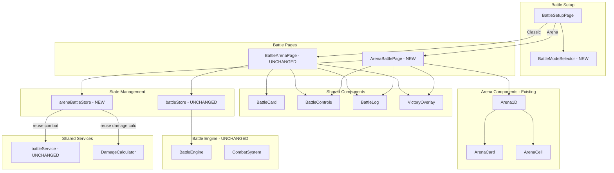

# Design Document: Arena Battle Mode

## Overview

Arena Battle Mode mở rộng hệ thống battle hiện tại bằng cách thêm chế độ chiến đấu trên sàn 1D. Tính năng này **kế thừa** và **tái sử dụng** các component/service/engine hiện có, KHÔNG sửa đổi Classic Mode.

**Nguyên tắc thiết kế:**

- Classic Mode (BattleArenaPage) giữ nguyên 100%
- Arena Mode tạo page mới, kế thừa logic combat từ battle engine
- Tách các phần dùng chung thành shared components/services
- Composition over modification

Hai chế độ battle:

- **Classic Mode**: Combat ngay lập tức (giữ nguyên behavior hiện tại)
- **Arena Mode**: Card di chuyển trên sàn 8 ô, chỉ combat khi liền kề

## Architecture



## Shared vs New Components

### Shared (Reused by both modes)

| Component/Service | Location          | Usage                           |
| ----------------- | ----------------- | ------------------------------- |
| BattleControls    | battle/components | Attack/Auto buttons             |
| BattleLog         | battle/components | Combat log display              |
| VictoryOverlay    | battle/components | Win/lose screen                 |
| DamageNumber      | battle/components | Damage animation                |
| HealNumber        | battle/components | Lifesteal animation             |
| battleService     | battle/services   | calculateAttack, checkBattleEnd |
| DamageCalculator  | battle/engine     | Damage formulas                 |

### New (Arena Mode only)

| Component/Service  | Location           | Purpose                    |
| ------------------ | ------------------ | -------------------------- |
| BattleModeSelector | battle/components  | Mode selection UI          |
| ArenaBattlePage    | battle/pages       | Arena mode page            |
| arenaBattleStore   | battle/store       | Arena state management     |
| ArenaCardWithStats | arena1d/components | Card with HP/stats overlay |

### Unchanged (Classic Mode)

| Component/Service | Location      | Status     |
| ----------------- | ------------- | ---------- |
| BattleArenaPage   | battle/pages  | NO CHANGES |
| battleStore       | battle/store  | NO CHANGES |
| BattleEngine      | battle/engine | NO CHANGES |

## Components and Interfaces

### 1. BattleModeSelector Component (NEW)

Component mới để chọn mode battle trên setup page.

```typescript
interface BattleModeOption {
  id: "classic" | "arena";
  label: string;
  description: string;
  icon: React.ReactNode;
}

interface BattleModeSelectorProps {
  selectedMode: "classic" | "arena";
  onModeChange: (mode: "classic" | "arena") => void;
}
```

### 2. ArenaBattlePage Component (NEW)

Page mới cho Arena Mode battle, sử dụng Arena1D component và quản lý logic di chuyển/combat.
**Kế thừa**: Sử dụng BattleControls, BattleLog, VictoryOverlay từ battle/components.

```typescript
interface ArenaBattlePageProps {
  // No props - uses store state
}

// Internal state managed by arenaBattleStore
```

### 3. ArenaBattleStore (NEW)

Store mới để quản lý state của Arena Mode battle.
**Kế thừa**: Sử dụng calculateAttack, checkBattleEnd từ battleService.

```typescript
interface ArenaBattleState {
  // Card data (from battleStore selection)
  challenger: BattleCard | null;
  opponent: BattleCard | null;

  // Arena positions
  leftPosition: CellIndex;
  rightPosition: CellIndex;

  // Arena phase: 'setup' | 'moving' | 'combat' | 'finished'
  arenaPhase: ArenaPhase;

  // Turn tracking
  currentTurn: "challenger" | "opponent";

  // Battle log (reuse BattleLogEntry type)
  battleLog: BattleLogEntry[];

  // Result
  result: BattleResult;

  // Auto mode
  isAutoBattle: boolean;
}

interface ArenaBattleActions {
  // Initialize from selected cards
  initArena: (challenger: BattleCard, opponent: BattleCard) => void;

  // Arena actions
  executeMove: () => void;
  executeAttack: () => AttackResult | null; // Reuse from battleService

  // Auto battle
  toggleAutoBattle: () => void;

  // Reset
  resetArena: () => void;
}
```

### 4. ArenaCardWithStats Component (NEW)

Wrapper component hiển thị card trong arena với HP bar và stats overlay.
**Kế thừa**: Sử dụng ArenaCard từ arena1d/components, thêm HP bar overlay.

```typescript
interface ArenaCardWithStatsProps {
  card: ArenaCardData & {
    currentHp: number;
    maxHp: number;
    atk: number;
    def: number;
  };
  side: CardSide;
  isMoving: boolean;
  isInCombat: boolean;
  isDanger: boolean;
  damageDisplay?: { damage: number; isCritical: boolean } | null;
  healDisplay?: { healAmount: number } | null;
}
```

### 5. BattleSetupPage (MINIMAL CHANGES)

Chỉ thêm BattleModeSelector và logic navigation dựa trên mode.
**Không thay đổi**: Logic chọn card, validation, UI layout hiện tại.

## Data Models

### ArenaPhase (extended)

```typescript
type ArenaPhase = "setup" | "moving" | "combat" | "finished";
```

### BattleMode

```typescript
type BattleMode = "classic" | "arena";

interface BattleModeConfig {
  mode: BattleMode;
  label: string;
  description: string;
  arenaRoute: string;
}
```

### Position Calculation

```typescript
// Calculate distance between two positions
function getDistance(pos1: CellIndex, pos2: CellIndex): number {
  return Math.abs(pos1 - pos2);
}

// Check if positions are adjacent (distance = 1)
function areAdjacent(pos1: CellIndex, pos2: CellIndex): boolean {
  return getDistance(pos1, pos2) === 1;
}

// Calculate next position toward opponent
function getNextPosition(
  currentPos: CellIndex,
  targetPos: CellIndex
): CellIndex {
  if (currentPos < targetPos) {
    return (currentPos + 1) as CellIndex;
  }
  return (currentPos - 1) as CellIndex;
}
```

## Correctness Properties

_A property is a characteristic or behavior that should hold true across all valid executions of a system-essentially, a formal statement about what the system should do. Properties serve as the bridge between human-readable specifications and machine-verifiable correctness guarantees._

### Property 1: Navigation routes to correct page based on mode

_For any_ selected battle mode (classic or arena), clicking Start Battle should navigate to the corresponding arena page (/battle/arena for classic, /battle/arena-1d for arena).
**Validates: Requirements 1.4**

### Property 2: Initial positions are at boundaries

_For any_ arena battle start, the challenger card should be at position 0 (left boundary) and the opponent card should be at position 7 (right boundary).
**Validates: Requirements 2.2, 2.3**

### Property 3: Phase determination by distance

_For any_ two card positions, if distance > 1 then phase should be 'moving', if distance = 1 then phase should be 'combat'.
**Validates: Requirements 3.1, 4.1**

### Property 4: Movement is exactly 1 cell toward opponent

_For any_ movement action, the moving card's new position should be exactly 1 cell closer to the opponent's position.
**Validates: Requirements 3.2**

### Property 5: Turn alternates after movement

_For any_ completed movement, the current turn should switch to the other card.
**Validates: Requirements 3.4**

### Property 6: Combat executes attacks correctly

_For any_ attack in combat phase, the damage calculation should use the existing battle engine and update defender HP accordingly.
**Validates: Requirements 4.2**

### Property 7: Battle ends when HP reaches 0

_For any_ card with HP <= 0, the battle should transition to 'finished' phase.
**Validates: Requirements 4.4**

### Property 8: Auto-battle executes correct action for phase

_For any_ auto-battle tick, if in 'moving' phase execute move, if in 'combat' phase execute attack.
**Validates: Requirements 5.3**

### Property 9: HP bar reflects current HP

_For any_ damage taken, the HP bar value should equal currentHp / maxHp.
**Validates: Requirements 6.2**

### Property 10: Danger state triggers below 25% HP

_For any_ card with currentHp / maxHp < 0.25, the danger state should be true.
**Validates: Requirements 6.3**

## Error Handling

1. **No cards selected**: Redirect to setup page if navigating to arena without selected cards
2. **Invalid position**: Clamp positions to valid CellIndex range (0-7)
3. **Battle engine errors**: Catch and display error toast, allow retry
4. **Store sync issues**: Ensure arena store and battle store stay synchronized

## Testing Strategy

### Property-Based Testing Library

- **fast-check** for TypeScript property-based testing

### Unit Tests

- BattleModeSelector renders both options
- ArenaBattlePage renders Arena1D component
- Position calculation functions
- Phase determination logic

### Property-Based Tests

Each correctness property will be implemented as a property-based test using fast-check:

1. **Property 1**: Generate random mode, verify navigation target
2. **Property 2**: Generate random cards, verify initial positions
3. **Property 3**: Generate random positions, verify phase
4. **Property 4**: Generate random positions, verify movement
5. **Property 5**: Generate random turns, verify alternation
6. **Property 6**: Generate random combatants, verify damage
7. **Property 7**: Generate random HP values, verify battle end
8. **Property 8**: Generate random phases, verify auto-battle action
9. **Property 9**: Generate random HP values, verify bar value
10. **Property 10**: Generate random HP ratios, verify danger state

### Test Annotations

Each property-based test must include:

```typescript
// **Feature: arena-battle-mode, Property {number}: {property_text}**
// **Validates: Requirements X.Y**
```

### Integration Tests

- Full battle flow from setup to victory in Arena Mode
- Mode switching on setup page
- Auto-battle in Arena Mode
