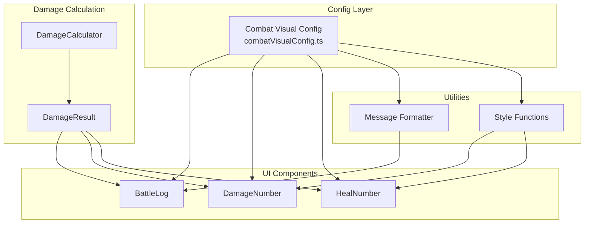

# Design Document: Battle Combat Visuals

## Overview

Feature này nâng cấp hệ thống battle để hiển thị chi tiết crit damage và lifesteal trong Battle Log, đồng thời thêm floating combat numbers trên màn hình battle. Tất cả được implement theo hướng config-driven với một central config file định nghĩa styles, colors, animations và message templates.

## Architecture



## Components and Interfaces

### 1. Combat Visual Config (combatVisualConfig.ts)

Central configuration file cho tất cả combat visual settings.

```typescript
// Damage type identifiers
type DamageType = "normal" | "crit" | "heal";

// Style definition for each damage type
interface DamageTypeStyle {
  color: string; // CSS color value
  fontSize: string; // CSS font-size (e.g., "1.5rem", "2rem")
  fontWeight: string; // CSS font-weight
  label?: string; // Optional label (e.g., "CRIT!")
  prefix?: string; // Optional prefix (e.g., "+", "-")
}

// Animation settings
interface AnimationConfig {
  duration: number; // Duration in ms
  easing: string; // CSS easing function
  direction: "up" | "down";
  distance: string; // CSS distance (e.g., "50px")
}

// Message template placeholders: {attacker}, {defender}, {damage}, {critBonus}, {healAmount}
interface MessageTemplates {
  attack: string;
  attackWithCrit: string;
  attackWithLifesteal: string;
  attackWithCritAndLifesteal: string;
}

// Complete config
interface CombatVisualConfig {
  damageStyles: Record<DamageType, DamageTypeStyle>;
  animation: AnimationConfig;
  messageTemplates: MessageTemplates;
}

// Default config
const COMBAT_VISUAL_CONFIG: CombatVisualConfig = {
  damageStyles: {
    normal: {
      color: "#ffffff",
      fontSize: "1.5rem",
      fontWeight: "600",
      prefix: "-",
    },
    crit: {
      color: "#f59e0b", // amber-500
      fontSize: "2rem",
      fontWeight: "700",
      label: "CRIT!",
      prefix: "-",
    },
    heal: {
      color: "#22c55e", // green-500
      fontSize: "1.5rem",
      fontWeight: "600",
      prefix: "+",
    },
  },
  animation: {
    duration: 800,
    easing: "ease-out",
    direction: "up",
    distance: "50px",
  },
  messageTemplates: {
    attack: "{attacker} deals {damage} damage to {defender}",
    attackWithCrit:
      "{attacker} deals {damage} damage to {defender} (CRIT! +{critBonus})",
    attackWithLifesteal:
      "{attacker} deals {damage} damage to {defender}, heals {healAmount} HP",
    attackWithCritAndLifesteal:
      "{attacker} deals {damage} damage to {defender} (CRIT! +{critBonus}), heals {healAmount} HP",
  },
};
```

### 2. DamageResult Interface

Extended damage calculation result with detailed breakdown.

```typescript
interface DamageResult {
  finalDamage: number; // Total damage after all modifiers
  baseDamage: number; // Damage before crit
  isCrit: boolean; // Whether crit was rolled
  critBonus: number; // Extra damage from crit (finalDamage - baseDamage if crit)
  lifestealAmount: number; // HP healed from lifesteal
}

// Extended DamageCalculator method
interface DamageCalculator {
  // ... existing methods
  calculateWithDetails(input: DamageCalculationInput): DamageResult;
}
```

### 3. Message Formatter Utility

```typescript
interface FormatMessageParams {
  attacker: string;
  defender: string;
  damageResult: DamageResult;
}

function formatBattleMessage(params: FormatMessageParams): string {
  const { attacker, defender, damageResult } = params;
  const { finalDamage, isCrit, critBonus, lifestealAmount } = damageResult;

  // Select appropriate template based on damage result
  let template: string;
  if (isCrit && lifestealAmount > 0) {
    template = COMBAT_VISUAL_CONFIG.messageTemplates.attackWithCritAndLifesteal;
  } else if (isCrit) {
    template = COMBAT_VISUAL_CONFIG.messageTemplates.attackWithCrit;
  } else if (lifestealAmount > 0) {
    template = COMBAT_VISUAL_CONFIG.messageTemplates.attackWithLifesteal;
  } else {
    template = COMBAT_VISUAL_CONFIG.messageTemplates.attack;
  }

  // Replace placeholders
  return template
    .replace("{attacker}", attacker)
    .replace("{defender}", defender)
    .replace("{damage}", String(finalDamage))
    .replace("{critBonus}", String(critBonus))
    .replace("{healAmount}", String(lifestealAmount));
}
```

### 4. Style Functions

```typescript
function getDamageTypeStyle(type: DamageType): DamageTypeStyle {
  return COMBAT_VISUAL_CONFIG.damageStyles[type];
}

function getAnimationConfig(): AnimationConfig {
  return COMBAT_VISUAL_CONFIG.animation;
}

function getDamageTypeFromResult(damageResult: DamageResult): DamageType {
  return damageResult.isCrit ? "crit" : "normal";
}
```

### 5. Updated DamageNumber Component

```typescript
interface DamageNumberProps {
  damageResult: DamageResult;
  position: CardPosition;
  onAnimationEnd: () => void;
}

function DamageNumber({
  damageResult,
  position,
  onAnimationEnd,
}: DamageNumberProps) {
  const damageType = getDamageTypeFromResult(damageResult);
  const style = getDamageTypeStyle(damageType);
  const animation = getAnimationConfig();

  // Render with config-driven styling
  return (
    <div
      className="damage-number"
      style={{
        color: style.color,
        fontSize: style.fontSize,
        fontWeight: style.fontWeight,
        animation: `fly-${animation.direction} ${animation.duration}ms ${animation.easing}`,
      }}
    >
      {style.prefix}
      {damageResult.finalDamage}
      {style.label && <span className="damage-label">{style.label}</span>}
    </div>
  );
}
```

### 6. HealNumber Component (New)

```typescript
interface HealNumberProps {
  healAmount: number;
  position: CardPosition;
  onAnimationEnd: () => void;
}

function HealNumber({ healAmount, position, onAnimationEnd }: HealNumberProps) {
  const style = getDamageTypeStyle("heal");
  const animation = getAnimationConfig();

  return (
    <div
      className="heal-number"
      style={{
        color: style.color,
        fontSize: style.fontSize,
        fontWeight: style.fontWeight,
        animation: `fly-${animation.direction} ${animation.duration}ms ${animation.easing}`,
      }}
    >
      {style.prefix}
      {healAmount}
    </div>
  );
}
```

## Data Models

### DamageResult

| Field           | Type    | Description                                  |
| --------------- | ------- | -------------------------------------------- |
| finalDamage     | number  | Total damage after all modifiers             |
| baseDamage      | number  | Damage before crit multiplier                |
| isCrit          | boolean | Whether critical hit was rolled              |
| critBonus       | number  | Extra damage from crit (0 if no crit)        |
| lifestealAmount | number  | HP healed from lifesteal (0 if no lifesteal) |

### DamageTypeStyle

| Field      | Type    | Description                      |
| ---------- | ------- | -------------------------------- |
| color      | string  | CSS color value                  |
| fontSize   | string  | CSS font-size                    |
| fontWeight | string  | CSS font-weight                  |
| label      | string? | Optional label (e.g., "CRIT!")   |
| prefix     | string? | Optional prefix (e.g., "+", "-") |

### AnimationConfig

| Field     | Type           | Description              |
| --------- | -------------- | ------------------------ |
| duration  | number         | Animation duration in ms |
| easing    | string         | CSS easing function      |
| direction | "up" \| "down" | Animation direction      |
| distance  | string         | CSS distance to travel   |

## Correctness Properties

_A property is a characteristic or behavior that should hold true across all valid executions of a system-essentially, a formal statement about what the system should do. Properties serve as the bridge between human-readable specifications and machine-verifiable correctness guarantees._

### Property Reflection

After analyzing the prework, I identified the following consolidations:

- Properties 1.1, 1.2, 1.3 can be combined into one config completeness property
- Properties 3.2, 3.3, 5.2, 5.3 are all about style retrieval - can be combined
- Properties 2.1, 2.2, 2.3 are about message formatting - can be combined
- Properties 4.1, 4.2, 4.3 are about DamageResult calculation - keep separate for clarity

### Consolidated Properties

**Property 1: Config Completeness**
_For any_ damage type in the config, the style definition SHALL contain all required fields (color, fontSize, fontWeight). _For any_ message template, it SHALL contain the required placeholders for its type.
**Validates: Requirements 1.1, 1.2, 1.3**

**Property 2: Message Formatting Correctness**
_For any_ DamageResult, the formatted message SHALL contain the finalDamage value. _For any_ DamageResult with isCrit=true, the message SHALL contain the crit indicator. _For any_ DamageResult with lifestealAmount>0, the message SHALL contain the heal amount.
**Validates: Requirements 2.1, 2.2, 2.3**

**Property 3: Style Retrieval Correctness**
_For any_ damage type (normal, crit, heal), getDamageTypeStyle SHALL return the corresponding style from config with correct color, fontSize, and fontWeight values.
**Validates: Requirements 3.2, 3.3, 5.2, 5.3**

**Property 4: DamageResult Structure Completeness**
_For any_ damage calculation, the returned DamageResult SHALL contain all required fields: finalDamage, baseDamage, isCrit, critBonus, lifestealAmount.
**Validates: Requirements 4.1**

**Property 5: Crit Bonus Calculation**
_For any_ DamageResult where isCrit=true, critBonus SHALL equal (finalDamage - baseDamage). _For any_ DamageResult where isCrit=false, critBonus SHALL equal 0.
**Validates: Requirements 4.2**

**Property 6: Lifesteal Calculation**
_For any_ damage and lifesteal percentage, lifestealAmount SHALL equal floor(finalDamage × lifesteal / 100).
**Validates: Requirements 4.3**

## Error Handling

1. **Missing Config Values**: Use default values if specific config values are missing
2. **Invalid Damage Type**: Return default "normal" style for unknown damage types
3. **Missing Template Placeholders**: Log warning but still render message with available data
4. **Zero/Negative Damage**: Display 0 for damage, skip heal number if lifestealAmount <= 0

## Testing Strategy

### Property-Based Testing

Sử dụng `fast-check` library cho property-based testing.

Mỗi property test sẽ:

1. Generate random inputs (damage values, crit states, lifesteal percentages)
2. Test that the property holds across all generated inputs
3. Run minimum 100 iterations

Format: `**Feature: battle-combat-visuals, Property {number}: {property_text}**`

### Unit Tests

- Test config structure validation
- Test message formatting with various DamageResult combinations
- Test style retrieval for each damage type
- Test DamageResult calculation edge cases (0 damage, 100% crit, 0% lifesteal)

### Integration Tests

- Test BattleLog renders correct messages for different attack types
- Test DamageNumber displays correct styling based on DamageResult
- Test HealNumber appears when lifestealAmount > 0
