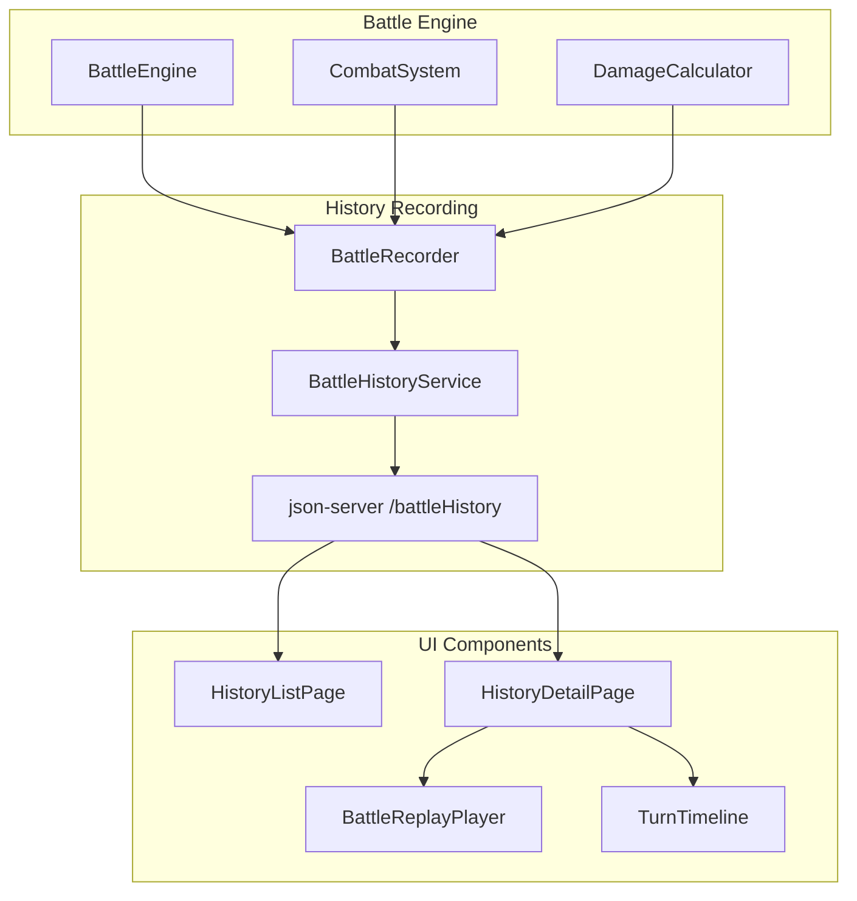

# Design Document: Battle History & Replay

## Overview

Feature này cho phép lưu trữ chi tiết từng trận đấu vào json-server và replay lại. Khi auto-battle chạy, hệ thống sẽ tính toán toàn bộ trận đấu trước, lưu BattleRecord với đầy đủ thông tin (combatant snapshots, turn records với damage breakdown chi tiết, HP timeline), sau đó replay animation từ data đã lưu. Người chơi có thể xem History list, xem chi tiết từng turn, hoặc replay animation với controls (play/pause, speed).

## Architecture



## Components and Interfaces

### 1. Data Types (battleHistoryTypes.ts)

```typescript
// Snapshot đầy đủ stats của card lúc bắt đầu trận
interface CombatantSnapshot {
  id: string;
  name: string;
  imageUrl: string | null;

  // HP
  maxHp: number;
  currentHp: number; // HP lúc bắt đầu trận (= maxHp)

  // Core Stats (Tier 1)
  atk: number;
  def: number;
  spd: number;

  // Combat Stats (Tier 2)
  critChance: number; // 0-100
  critDamage: number; // 100+ (150 = 1.5x)
  armorPen: number; // 0-100
  lifesteal: number; // 0-100
}

// Chi tiết damage calculation
interface DamageBreakdown {
  baseDamage: number; // Damage trước crit
  isCrit: boolean; // Có crit không
  critMultiplier: number; // 1.0 hoặc critDamage/100 (e.g. 1.5)
  critBonus: number; // Damage thêm từ crit (finalDamage - baseDamage nếu crit)
  armorPenPercent: number; // % armor pen của attacker
  defenderOriginalDef: number; // DEF gốc của defender
  effectiveDefense: number; // DEF sau khi bị armor pen
  finalDamage: number; // Damage cuối cùng
}

// Chi tiết lifesteal
interface LifestealDetail {
  attackerLifestealPercent: number; // % lifesteal của attacker
  lifestealAmount: number; // HP hồi được
  attackerHpBefore: number; // HP attacker trước khi hồi
  attackerHpAfter: number; // HP attacker sau khi hồi
  attackerMaxHp: number; // Max HP để cap
}

// Chi tiết HP của defender
interface DefenderHpState {
  defenderHpBefore: number;
  defenderHpAfter: number;
  defenderMaxHp: number;
  isKnockout: boolean;
}

// Record cho 1 turn
interface TurnRecord {
  turnNumber: number;
  timestamp: number;

  // Identity
  attackerId: string;
  attackerName: string;
  defenderId: string;
  defenderName: string;

  // Damage detail
  damage: DamageBreakdown;

  // Lifesteal detail
  lifesteal: LifestealDetail;

  // Defender HP
  defenderHp: DefenderHpState;
}

// HP state tại một thời điểm (cho timeline/chart)
interface HpTimelineEntry {
  turnNumber: number; // 0 = initial state
  timestamp: number;
  challengerHp: number;
  challengerMaxHp: number;
  opponentHp: number;
  opponentMaxHp: number;
}

// Record cho toàn bộ trận đấu
interface BattleRecord {
  id: string; // UUID
  startedAt: number; // Timestamp bắt đầu
  endedAt: number; // Timestamp kết thúc
  battleDurationMs: number; // endedAt - startedAt

  // Combatants
  challenger: CombatantSnapshot;
  opponent: CombatantSnapshot;

  // Result
  winnerId: string;
  winnerName: string;
  totalTurns: number;

  // Detailed records
  turns: TurnRecord[];
  hpTimeline: HpTimelineEntry[];
}
```

### 2. BattleRecorder (battleRecorder.ts)

Service để record battle data trong quá trình battle.

```typescript
interface BattleRecorderInstance {
  // Bắt đầu record trận mới
  startRecording(challenger: Combatant, opponent: Combatant): void;

  // Record 1 turn
  recordTurn(
    turnNumber: number,
    attacker: Combatant,
    defender: Combatant,
    damageResult: DamageResult,
    defenderNewHp: number,
    attackerNewHp: number
  ): void;

  // Kết thúc và trả về BattleRecord
  finishRecording(winnerId: string, winnerName: string): BattleRecord;

  // Reset
  reset(): void;
}

function createBattleRecorder(): BattleRecorderInstance;
```

### 3. BattleHistoryService (battleHistoryService.ts)

Service để persist và fetch battle history từ json-server.

```typescript
interface BattleHistoryService {
  // Save battle record
  saveBattle(record: BattleRecord): Promise<BattleRecord>;

  // Fetch all battles (paginated)
  getBattles(
    page: number,
    limit: number
  ): Promise<{
    data: BattleRecord[];
    total: number;
    page: number;
    totalPages: number;
  }>;

  // Fetch single battle
  getBattleById(id: string): Promise<BattleRecord | null>;

  // Delete battle
  deleteBattle(id: string): Promise<void>;
}
```

### 4. BattleReplayPlayer Component

Component để replay animation từ BattleRecord.

```typescript
interface BattleReplayPlayerProps {
  battleRecord: BattleRecord;
  onComplete?: () => void;
}

interface ReplayState {
  isPlaying: boolean;
  currentTurn: number;
  speed: 1 | 2 | 4;
  challengerHp: number;
  opponentHp: number;
}

// Controls
interface ReplayControls {
  play(): void;
  pause(): void;
  reset(): void;
  setSpeed(speed: 1 | 2 | 4): void;
  goToTurn(turn: number): void;
}
```

## Data Models

### BattleRecord (stored in json-server)

| Field            | Type              | Description                      |
| ---------------- | ----------------- | -------------------------------- |
| id               | string            | UUID unique identifier           |
| startedAt        | number            | Unix timestamp (ms) khi bắt đầu  |
| endedAt          | number            | Unix timestamp (ms) khi kết thúc |
| battleDurationMs | number            | Thời gian trận (ms)              |
| challenger       | CombatantSnapshot | Full stats của challenger        |
| opponent         | CombatantSnapshot | Full stats của opponent          |
| winnerId         | string            | ID của người thắng               |
| winnerName       | string            | Tên người thắng                  |
| totalTurns       | number            | Tổng số turn                     |
| turns            | TurnRecord[]      | Chi tiết từng turn               |
| hpTimeline       | HpTimelineEntry[] | HP sau mỗi turn                  |

### TurnRecord

| Field        | Type            | Description              |
| ------------ | --------------- | ------------------------ |
| turnNumber   | number          | Số thứ tự turn (1-based) |
| timestamp    | number          | Timestamp của action     |
| attackerId   | string          | ID attacker              |
| attackerName | string          | Tên attacker             |
| defenderId   | string          | ID defender              |
| defenderName | string          | Tên defender             |
| damage       | DamageBreakdown | Chi tiết damage          |
| lifesteal    | LifestealDetail | Chi tiết lifesteal       |
| defenderHp   | DefenderHpState | HP defender              |

## Correctness Properties

_A property is a characteristic or behavior that should hold true across all valid executions of a system-essentially, a formal statement about what the system should do. Properties serve as the bridge between human-readable specifications and machine-verifiable correctness guarantees._

### Property Reflection

After analyzing the prework, consolidations:

- Structure completeness properties for BattleRecord, TurnRecord, HpTimeline can be combined
- Calculation properties (HP, damage, lifesteal) should be separate for clarity
- Round-trip serialization is unique

### Consolidated Properties

**Property 1: BattleRecord Structure Completeness**
_For any_ BattleRecord, all required fields SHALL be present and non-null: id, startedAt, endedAt, battleDurationMs, challenger (with full stats), opponent (with full stats), winnerId, winnerName, totalTurns, turns array, hpTimeline array.
**Validates: Requirements 1.2, 1.4**

**Property 2: TurnRecord Structure Completeness**
_For any_ TurnRecord in a BattleRecord, all required fields SHALL be present: turnNumber, timestamp, attackerId, attackerName, defenderId, defenderName, damage (with all breakdown fields), lifesteal (with all detail fields), defenderHp (with all state fields).
**Validates: Requirements 2.1, 2.2, 2.3, 2.4, 2.5**

**Property 3: Turn Order Preservation**
_For any_ BattleRecord with n turns, the turnNumber values SHALL be sequential from 1 to n with no gaps or duplicates.
**Validates: Requirements 2.6**

**Property 4: HP Timeline Consistency**
_For any_ BattleRecord, hpTimeline SHALL have exactly (totalTurns + 1) entries, starting with turn 0 (initial state). Each entry's HP values SHALL match the corresponding turn's HP changes.
**Validates: Requirements 5.1, 5.2, 5.6**

**Property 5: Defender HP Calculation**
_For any_ TurnRecord, defenderHpAfter SHALL equal max(0, defenderHpBefore - finalDamage), and isKnockout SHALL be true if and only if defenderHpAfter equals 0.
**Validates: Requirements 2.4**

**Property 6: Lifesteal Calculation**
_For any_ TurnRecord where attackerLifestealPercent > 0, lifestealAmount SHALL equal floor(finalDamage \* attackerLifestealPercent / 100), and attackerHpAfter SHALL equal min(attackerHpBefore + lifestealAmount, attackerMaxHp).
**Validates: Requirements 2.3**

**Property 7: Battle Duration Calculation**
_For any_ BattleRecord, battleDurationMs SHALL equal (endedAt - startedAt) and SHALL be >= 0.
**Validates: Requirements 5.3**

**Property 8: JSON Round-Trip Serialization**
_For any_ valid BattleRecord, JSON.parse(JSON.stringify(record)) SHALL produce a deeply equal object.
**Validates: Requirements 5.4**

## Error Handling

1. **API Errors**: Retry với exponential backoff, show error toast nếu fail
2. **Invalid Battle Data**: Validate trước khi save, reject invalid records
3. **Missing Fields**: Use default values hoặc throw error tùy field
4. **Replay Errors**: Pause replay và show error message

## Testing Strategy

### Property-Based Testing

Sử dụng `fast-check` library cho property-based testing.

Mỗi property test sẽ:

1. Generate random BattleRecords với random combatants và turns
2. Test that the property holds across all generated inputs
3. Run minimum 100 iterations

Format: `**Feature: battle-history, Property {number}: {property_text}**`

### Unit Tests

- Test BattleRecorder: startRecording, recordTurn, finishRecording
- Test BattleHistoryService: CRUD operations
- Test HP/damage calculations
- Test serialization/deserialization

### Integration Tests

- Test full flow: battle -> record -> save -> fetch -> display
- Test replay player với mock data
