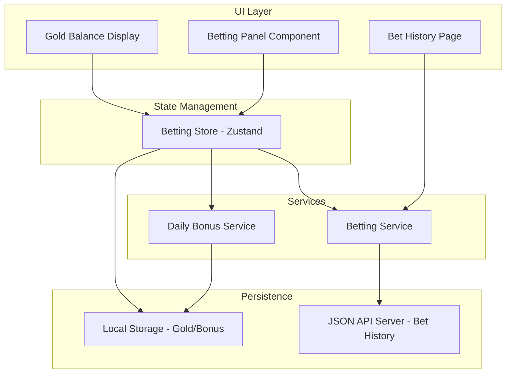

# Design Document: Betting System

## Overview

Hệ thống Betting cho phép người chơi đặt cược gold vào kết quả trận battle. Tính năng bao gồm:

- Daily bonus 1000 gold mỗi ngày
- Đặt cược vào card sẽ thắng trước khi battle bắt đầu
- Payout x2 khi thắng, mất gold khi thua
- Lưu trữ lịch sử bet vào json-api server
- Xem lại lịch sử betting

## Architecture



## Components and Interfaces

### 1. Types (src/features/betting/types/betting.ts)

```typescript
/**
 * Bet record stored in json-api
 */
export interface BetRecord {
  id: string;
  battleId: string;
  betAmount: number;
  selectedCardId: string;
  selectedCardName: string;
  winnerCardId: string;
  winnerCardName: string;
  payoutAmount: number;
  result: "win" | "lose";
  timestamp: number;
}

/**
 * Active bet during battle
 */
export interface ActiveBet {
  selectedCardId: string;
  betAmount: number;
}

/**
 * Daily bonus claim record
 */
export interface DailyBonusClaim {
  lastClaimDate: string; // ISO date string YYYY-MM-DD
  lastClaimTimestamp: number;
}

/**
 * Betting state
 */
export interface BettingState {
  goldBalance: number;
  activeBet: ActiveBet | null;
  canPlaceBet: boolean;
  dailyBonusClaimed: boolean;
}
```

### 2. Betting Store (src/features/betting/store/bettingStore.ts)

```typescript
interface BettingStoreState extends BettingState {
  // Actions
  placeBet: (cardId: string, amount: number) => boolean;
  resolveBet: (winnerId: string, battleId: string) => Promise<BetRecord>;
  claimDailyBonus: () => boolean;
  checkDailyBonus: () => boolean;
  loadBalance: () => void;
  clearActiveBet: () => void;
}
```

### 3. Betting Service (src/features/betting/services/bettingService.ts)

```typescript
export const bettingService = {
  // Persist bet record to json-api
  saveBetRecord: (record: BetRecord) => Promise<BetRecord>;

  // Get paginated bet history
  getBetHistory: (page: number, limit: number) => Promise<PaginatedBetResponse>;

  // Get single bet record
  getBetById: (id: string) => Promise<BetRecord | null>;
};
```

### 4. Daily Bonus Service (src/features/betting/services/dailyBonusService.ts)

```typescript
export const dailyBonusService = {
  // Check if bonus can be claimed today
  canClaimToday: () => boolean;

  // Record claim timestamp
  recordClaim: () => void;

  // Get last claim info
  getLastClaim: () => DailyBonusClaim | null;
};
```

### 5. UI Components

- **BetBattlePage**: Trang bet battle riêng biệt, kế thừa logic battle hiện tại nhưng có thêm betting flow
- **BettingPanel**: Component cho phép chọn card để bet và nhập số gold
- **GoldBalanceDisplay**: Hiển thị gold balance trong header/floating menu
- **BetHistoryPage**: Trang xem lịch sử betting
- **BetHistoryList**: Danh sách các bet records
- **DailyBonusNotification**: Toast notification khi nhận daily bonus
- **BetResultOverlay**: Hiển thị kết quả bet sau khi battle kết thúc

## Data Models

### BetRecord (JSON API)

```json
{
  "id": "uuid",
  "battleId": "uuid",
  "betAmount": 100,
  "selectedCardId": "card-uuid",
  "selectedCardName": "Fire Dragon",
  "winnerCardId": "card-uuid",
  "winnerCardName": "Fire Dragon",
  "payoutAmount": 200,
  "result": "win",
  "timestamp": 1702300800000
}
```

### Local Storage Keys

- `betting_gold_balance`: number - Current gold balance
- `betting_daily_bonus`: DailyBonusClaim - Last bonus claim info

## Correctness Properties

_A property is a characteristic or behavior that should hold true across all valid executions of a system-essentially, a formal statement about what the system should do. Properties serve as the bridge between human-readable specifications and machine-verifiable correctness guarantees._

### Property 1: Daily Bonus Once Per Day

_For any_ sequence of daily bonus claim attempts on the same calendar day, only the first attempt SHALL succeed and credit 1000 gold; subsequent attempts SHALL be rejected.
**Validates: Requirements 1.1, 1.2**

### Property 2: Invalid Bet Rejection

_For any_ bet amount that is less than or equal to zero OR exceeds the current gold balance, the bet SHALL be rejected and the gold balance SHALL remain unchanged.
**Validates: Requirements 2.2, 2.3**

### Property 3: Bet Deduction Consistency

_For any_ valid bet placement with amount A and initial balance B, the resulting balance SHALL equal B - A.
**Validates: Requirements 2.4**

### Property 4: Battle Phase Bet Prevention

_For any_ attempt to place a bet while a battle is in progress (phase = 'fighting'), the bet SHALL be rejected.
**Validates: Requirements 2.5**

### Property 5: Payout Calculation

_For any_ resolved bet with amount A, if the selected card matches the winner then payout SHALL equal 2 \* A, otherwise payout SHALL equal 0.
**Validates: Requirements 3.1, 3.2**

### Property 6: Bet Record Completeness

_For any_ persisted bet record, it SHALL contain all required fields: id, battleId, betAmount, selectedCardId, selectedCardName, winnerCardId, winnerCardName, payoutAmount, result, and timestamp.
**Validates: Requirements 4.2**

### Property 7: Bet Record Serialization Round-Trip

_For any_ valid BetRecord object, serializing to JSON and then deserializing SHALL produce an equivalent object.
**Validates: Requirements 4.4, 4.5**

### Property 8: Bet History Sorting

_For any_ list of bet records returned from getBetHistory, the records SHALL be sorted by timestamp in descending order (newest first).
**Validates: Requirements 5.1**

### Property 9: Balance Persistence Consistency

_For any_ gold balance change (bet placed, payout received, daily bonus), the new balance SHALL be persisted to local storage immediately and match the in-memory state.
**Validates: Requirements 6.2, 6.3**

## Error Handling

### Network Errors

- Khi json-api server không khả dụng, bet record sẽ được queue trong local storage
- Retry mechanism với exponential backoff
- UI hiển thị sync status indicator

### Validation Errors

- Bet amount validation: reject nếu <= 0 hoặc > balance
- Card selection validation: reject nếu card không tồn tại
- Battle phase validation: reject nếu battle đang diễn ra

### Edge Cases

- Gold balance = 0: Disable bet placement, show "Insufficient funds"
- Daily bonus already claimed: Show "Come back tomorrow"
- Empty bet history: Show empty state message

## Testing Strategy

### Property-Based Testing Library

Sử dụng **fast-check** cho property-based testing trong TypeScript/JavaScript.

### Unit Tests

- Test các service functions riêng lẻ
- Test store actions và state transitions
- Test validation logic

### Property-Based Tests

Mỗi correctness property sẽ được implement bằng một property-based test:

1. **Property 1**: Generate random sequences of claim attempts, verify only first succeeds per day
2. **Property 2**: Generate random invalid amounts, verify all rejected
3. **Property 3**: Generate random valid bets, verify balance deduction
4. **Property 4**: Generate bets during battle phase, verify rejection
5. **Property 5**: Generate random bet outcomes, verify payout calculation
6. **Property 6**: Generate random bet records, verify all fields present
7. **Property 7**: Generate random BetRecord objects, verify JSON round-trip
8. **Property 8**: Generate random bet lists, verify sorting
9. **Property 9**: Generate random balance changes, verify persistence

### Test Configuration

- Minimum 100 iterations per property test
- Each test tagged with: `**Feature: betting-system, Property {number}: {property_text}**`
