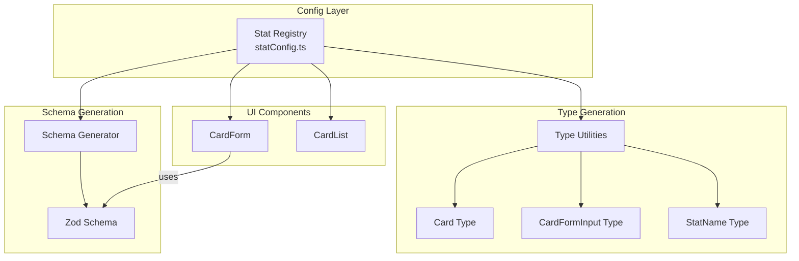

# Design Document: Config-Driven Stats System

## Overview

Hệ thống Config-Driven Stats cho phép định nghĩa tất cả card stats trong một file config tập trung. Các component (CardForm, CardList), validation schemas, và TypeScript types sẽ được generate/derive tự động từ config này. Khi thêm stat mới, developer chỉ cần thêm vào config file, không cần sửa code component.

## Architecture



## Components and Interfaces

### 1. Stat Registry (statConfig.ts)

Central configuration file chứa tất cả stat definitions.

```typescript
// Stat format types
type StatFormat = "number" | "percentage";

// Stat tier for grouping
type StatTier = "core" | "combat" | "utility";

// Single stat definition
interface StatDefinition {
  key: string; // Unique identifier (e.g., 'hp', 'critChance')
  label: string; // Display label (e.g., 'HP (Hit Points)')
  shortLabel: string; // Short label for compact view (e.g., 'HP')
  tier: StatTier; // Grouping tier
  defaultValue: number; // Default value for new cards
  min: number; // Minimum allowed value
  max: number; // Maximum allowed value (Infinity for unlimited)
  format: StatFormat; // How to format the value
  decimalPlaces: number; // Number of decimal places
  icon: string; // Lucide icon name
  showInCompact: boolean; // Show in compact card view
  displayOrder: number; // Order within tier
}

// The registry - single source of truth
const STAT_REGISTRY: StatDefinition[] = [
  {
    key: "hp",
    label: "HP (Hit Points)",
    shortLabel: "HP",
    tier: "core",
    defaultValue: 1000,
    min: 1,
    max: Infinity,
    format: "number",
    decimalPlaces: 0,
    icon: "Heart",
    showInCompact: true,
    displayOrder: 1,
  },
  // ... more stats
];
```

### 2. Type Utilities (statTypes.ts)

Utilities để derive TypeScript types từ config.

```typescript
// Extract stat keys as union type
type StatKey = (typeof STAT_REGISTRY)[number]["key"];

// Generate Card stats type
type CardStats = {
  [K in StatKey]: number;
};

// Card interface with stats
interface Card extends CardStats {
  id: string;
  name: string;
  imagePath: string | null;
  imageUrl: string | null;
  createdAt: number;
  updatedAt: number;
}

// Form input with optional stats
type CardFormInput = {
  name: string;
  image: File | null;
} & Partial<CardStats>;
```

### 3. Schema Generator (schemaGenerator.ts)

Generate Zod schema từ config.

```typescript
function generateStatSchema(): z.ZodObject<...> {
  const shape: Record<string, z.ZodNumber> = {};

  for (const stat of STAT_REGISTRY) {
    let schema = z.number();

    if (stat.min !== -Infinity) {
      schema = schema.min(stat.min);
    }
    if (stat.max !== Infinity) {
      schema = schema.max(stat.max);
    }

    shape[stat.key] = schema.default(stat.defaultValue);
  }

  return z.object(shape);
}
```

### 4. CardForm Component Updates

```typescript
// Dynamic form field renderer
function StatFormField({
  stat,
  control,
}: {
  stat: StatDefinition;
  control: Control;
}) {
  return (
    <FormField
      control={control}
      name={stat.key}
      render={({ field }) => (
        <FormItem>
          <FormLabel>{stat.label}</FormLabel>
          <FormControl>
            <NumericFormat
              value={field.value}
              onValueChange={(v) =>
                field.onChange(v.floatValue ?? stat.defaultValue)
              }
              decimalScale={stat.decimalPlaces}
              suffix={stat.format === "percentage" ? "%" : undefined}
              customInput={Input}
            />
          </FormControl>
          <FormMessage />
        </FormItem>
      )}
    />
  );
}

// Group stats by tier and render
function CardForm() {
  const statsByTier = groupBy(STAT_REGISTRY, "tier");

  return (
    <Form>
      {Object.entries(statsByTier).map(([tier, stats]) => (
        <div key={tier}>
          <h3>{TIER_LABELS[tier]}</h3>
          <div className="grid grid-cols-2 gap-4">
            {stats
              .sort((a, b) => a.displayOrder - b.displayOrder)
              .map((stat) => (
                <StatFormField key={stat.key} stat={stat} />
              ))}
          </div>
        </div>
      ))}
    </Form>
  );
}
```

### 5. CardList Component Updates

```typescript
// Dynamic stat display
function StatDisplay({ stat, value }: { stat: StatDefinition; value: number }) {
  const Icon = Icons[stat.icon];
  const formatted =
    stat.format === "percentage"
      ? `${value.toFixed(stat.decimalPlaces)}%`
      : value.toLocaleString();

  return (
    <span className="flex items-center gap-1">
      <Icon className="h-4 w-4" />
      {formatted}
    </span>
  );
}

// Compact view shows only configured stats
function CardItem({ card }: { card: Card }) {
  const compactStats = STAT_REGISTRY.filter((s) => s.showInCompact);

  return (
    <div className="flex items-center gap-4">
      {compactStats.map((stat) => (
        <StatDisplay key={stat.key} stat={stat} value={card[stat.key]} />
      ))}
    </div>
  );
}
```

## Data Models

### StatDefinition

| Field         | Type       | Description                           |
| ------------- | ---------- | ------------------------------------- |
| key           | string     | Unique identifier, used as object key |
| label         | string     | Full display label for forms          |
| shortLabel    | string     | Short label for compact displays      |
| tier          | StatTier   | Grouping category                     |
| defaultValue  | number     | Default value for new cards           |
| min           | number     | Minimum validation value              |
| max           | number     | Maximum validation value              |
| format        | StatFormat | Display format type                   |
| decimalPlaces | number     | Decimal precision                     |
| icon          | string     | Lucide icon component name            |
| showInCompact | boolean    | Whether to show in card list          |
| displayOrder  | number     | Sort order within tier                |

### Tier Configuration

```typescript
const TIER_CONFIG = {
  core: { label: "Core Stats", order: 1 },
  combat: { label: "Combat Stats", order: 2 },
  utility: { label: "Utility Stats", order: 3 },
} as const;
```

## Correctness Properties

_A property is a characteristic or behavior that should hold true across all valid executions of a system-essentially, a formal statement about what the system should do. Properties serve as the bridge between human-readable specifications and machine-verifiable correctness guarantees._

### Property Reflection

After analyzing the prework, I identified the following redundancies:

- Properties 1.2, 5.1, 5.2, 5.3 are all about type derivation - can be combined
- Properties 2.3 and 4.3 both test default values - can be combined
- Properties 4.2 and 2.4 both test range validation - can be combined
- Properties 1.3 and 4.4 both test config change reflection - can be combined

### Consolidated Properties

**Property 1: Stat Registry Completeness**
_For any_ stat definition in the registry, the definition SHALL contain all required fields (key, label, shortLabel, tier, defaultValue, min, max, format, decimalPlaces, icon, showInCompact, displayOrder) with valid values.
**Validates: Requirements 1.1**

**Property 2: Schema-Config Consistency**
_For any_ stat in the registry, the generated Zod schema SHALL have a corresponding field with matching min/max validation and default value.
**Validates: Requirements 4.1, 4.2, 4.3, 2.3, 2.4**

**Property 3: Stat Grouping Correctness**
_For any_ tier in the registry, all stats with that tier SHALL be grouped together, and tiers SHALL be ordered according to TIER_CONFIG.
**Validates: Requirements 1.4, 2.5**

**Property 4: Format Application Correctness**
_For any_ stat with format 'percentage', the formatted output SHALL include '%' suffix. _For any_ stat, the formatted output SHALL respect the decimalPlaces configuration.
**Validates: Requirements 2.2, 3.3**

**Property 5: Compact View Filtering**
_For any_ card display in compact mode, only stats with showInCompact=true SHALL be displayed.
**Validates: Requirements 3.4**

**Property 6: Dynamic Field Generation**
_For any_ stat in the registry, the CardForm SHALL render exactly one form field for that stat with the correct label and input configuration.
**Validates: Requirements 2.1, 3.1**

**Property 7: Validation Range Enforcement**
_For any_ stat and _for any_ input value, the validation SHALL pass if and only if min <= value <= max as defined in the stat's config.
**Validates: Requirements 4.2, 2.4**

## Error Handling

1. **Invalid Stat Config**: Validate registry at startup, throw descriptive error if any stat definition is incomplete
2. **Missing Icon**: Fallback to a default icon if specified icon doesn't exist
3. **Invalid Range**: If min > max, throw configuration error at startup
4. **Duplicate Keys**: Validate no duplicate stat keys exist in registry

## Testing Strategy

### Property-Based Testing

Sử dụng `fast-check` library cho property-based testing.

Mỗi property test sẽ:

1. Generate random stat configurations
2. Test that the property holds across all generated inputs
3. Run minimum 100 iterations

Format: `**Feature: config-driven-stats, Property {number}: {property_text}**`

### Unit Tests

- Test schema generator với các edge cases (empty registry, single stat)
- Test format functions với các giá trị biên
- Test tier grouping với mixed tiers

### Integration Tests

- Test CardForm renders correct number of fields
- Test CardList displays correct stats in compact view
- Test end-to-end: add stat to config → form shows new field → validation works
