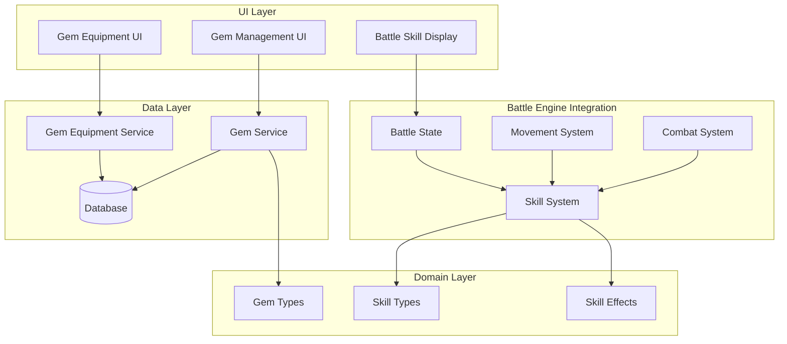

# Gem/Skill System Design Document

## Overview

Hệ thống Gem/Skill cho phép gắn các viên đá khảm (gem) vào card để cung cấp các skill đặc biệt trong battle. Mỗi card có tối đa 3 gem slots. Các skill được chia thành 2 loại trigger: Movement (kích hoạt khi di chuyển) và Combat (kích hoạt khi tấn công). Mỗi skill có activation chance (xác suất kích hoạt) và một số có cooldown.

## Architecture



## Components and Interfaces

### 1. Gem Types (`src/features/gems/types/gem.ts`)

```typescript
// Skill trigger types
type SkillTrigger = "movement" | "combat";

// Skill type enumeration
type SkillType =
  | "knockback" // Push enemy 1 cell away
  | "retreat" // Move back 1 cell after attack
  | "double_move" // Move 2 cells instead of 1
  | "double_attack" // Attack twice
  | "execute" // Kill if HP below threshold
  | "leap_strike"; // Jump to enemy and knockback 2

// Skill effect parameters
interface SkillEffectParams {
  knockbackDistance?: number; // For knockback/retreat
  moveDistance?: number; // For double_move
  attackCount?: number; // For double_attack
  executeThreshold?: number; // HP % for execute (0-100)
  leapRange?: number; // Detection range for leap
  leapKnockback?: number; // Knockback distance after leap
}

// Gem definition
interface Gem {
  id: string;
  name: string;
  description: string;
  skillType: SkillType;
  trigger: SkillTrigger;
  activationChance: number; // 0-100 percentage
  cooldown: number; // 0 = no cooldown
  effectParams: SkillEffectParams;
  createdAt: string;
  updatedAt: string;
}

// Gem form input
interface GemFormInput {
  name: string;
  description: string;
  skillType: SkillType;
  trigger: SkillTrigger;
  activationChance: number;
  cooldown: number;
  effectParams: SkillEffectParams;
}
```

### 2. Gem Equipment Types (`src/features/gems/types/equipment.ts`)

```typescript
// Card gem equipment
interface CardGemEquipment {
  cardId: string;
  gemIds: string[]; // Max 3 gems
}

// Equipped gem with runtime state
interface EquippedGemState {
  gem: Gem;
  currentCooldown: number; // Remaining cooldown turns
}

// Card with equipped gems in battle
interface BattleCardGems {
  cardId: string;
  equippedGems: EquippedGemState[];
}
```

### 3. Skill System (`src/features/battle/engine/systems/SkillSystem.ts`)

```typescript
interface SkillSystem {
  // Check and execute movement skills
  processMovementSkills(
    card: BattleCardGems,
    currentPosition: CellIndex,
    targetPosition: CellIndex,
    enemyPosition: CellIndex,
  ): MovementSkillResult;

  // Check and execute combat skills
  processCombatSkills(
    attacker: BattleCardGems,
    defender: BattleCardGems,
    attackerPosition: CellIndex,
    defenderPosition: CellIndex,
    attackResult: AttackResult,
  ): CombatSkillResult;

  // Decrement cooldowns at turn end
  decrementCooldowns(cardGems: BattleCardGems): BattleCardGems;

  // Roll for skill activation
  rollActivation(chance: number): boolean;
}

interface MovementSkillResult {
  finalPosition: CellIndex;
  skillsActivated: ActivatedSkill[];
  enemyNewPosition?: CellIndex; // For leap_strike knockback
}

interface CombatSkillResult {
  attackerNewPosition: CellIndex;
  defenderNewPosition: CellIndex;
  defenderNewHp: number;
  additionalAttacks: AttackResult[];
  skillsActivated: ActivatedSkill[];
}

interface ActivatedSkill {
  skillType: SkillType;
  gemId: string;
  gemName: string;
}
```

### 4. Gem Service (`src/features/gems/services/gemService.ts`)

```typescript
interface GemService {
  getAll(): Promise<Gem[]>;
  getById(id: string): Promise<Gem | null>;
  create(input: GemFormInput): Promise<Gem>;
  update(id: string, input: Partial<GemFormInput>): Promise<Gem>;
  delete(id: string): Promise<void>;
}
```

### 5. Gem Equipment Service (`src/features/gems/services/gemEquipmentService.ts`)

```typescript
interface GemEquipmentService {
  getCardGems(cardId: string): Promise<CardGemEquipment | null>;
  equipGem(cardId: string, gemId: string): Promise<CardGemEquipment>;
  unequipGem(cardId: string, gemId: string): Promise<CardGemEquipment>;
  unequipAllByGemId(gemId: string): Promise<void>; // When gem is deleted
}
```

## Data Models

### Database Schema (db.json)

```json
{
  "gems": [
    {
      "id": "gem-1",
      "name": "Knockback Stone",
      "description": "Pushes enemy back 1 cell on hit",
      "skillType": "knockback",
      "trigger": "combat",
      "activationChance": 30,
      "cooldown": 0,
      "effectParams": {
        "knockbackDistance": 1
      },
      "createdAt": "2025-01-01T00:00:00Z",
      "updatedAt": "2025-01-01T00:00:00Z"
    }
  ],
  "cardGemEquipments": [
    {
      "cardId": "card-1",
      "gemIds": ["gem-1", "gem-2"]
    }
  ]
}
```

### Default Gem Configurations

| Skill Type    | Trigger  | Default Chance | Default Cooldown | Effect Params                  |
| ------------- | -------- | -------------- | ---------------- | ------------------------------ |
| knockback     | combat   | 30%            | 0                | knockbackDistance: 1           |
| retreat       | combat   | 25%            | 0                | knockbackDistance: 1           |
| double_move   | movement | 20%            | 2                | moveDistance: 2                |
| double_attack | combat   | 15%            | 3                | attackCount: 2                 |
| execute       | combat   | 100%           | 4                | executeThreshold: 15           |
| leap_strike   | movement | 25%            | 3                | leapRange: 2, leapKnockback: 2 |

## Correctness Properties

_A property is a characteristic or behavior that should hold true across all valid executions of a system-essentially, a formal statement about what the system should do. Properties serve as the bridge between human-readable specifications and machine-verifiable correctness guarantees._

### Property Reflection

After analyzing the prework, the following redundancies were identified:

- Cooldown properties (3.3, 4.3, 5.3, 6.3, 7.3, 8.5) can be consolidated into a single cooldown property
- Logging properties (3.4, 4.4, 5.4, 6.4, 7.4, 8.6, 11.1) can be consolidated into a single logging property
- Boundary handling edge cases (3.2, 4.2, 5.2, 8.3) are covered by position clamping logic

### Consolidated Properties

**Property 1: Gem CRUD Round Trip**
_For any_ valid gem data, creating a gem and then retrieving it by ID should return an equivalent gem with all fields matching.
**Validates: Requirements 1.1, 1.3**

**Property 2: Gem Slot Limit Invariant**
_For any_ card, the number of equipped gems should never exceed 3.
**Validates: Requirements 2.1, 2.2**

**Property 3: Equip/Unequip Round Trip**
_For any_ card and gem, equipping then unequipping a gem should result in the gem not being in the card's gem list.
**Validates: Requirements 2.1, 2.3**

**Property 4: Knockback Position Change**
_For any_ attacker position A and defender position D where |A - D| = 1, knockback should move defender to position D + sign(D - A), clamped to [0, 7].
**Validates: Requirements 3.1, 3.2**

**Property 5: Retreat Position Change**
_For any_ attacker position A and defender position D where |A - D| = 1, retreat should move attacker to position A - sign(D - A), clamped to [0, 7].
**Validates: Requirements 4.1, 4.2**

**Property 6: Double Move Distance**
_For any_ card position P and move direction, double move should result in position P ± 2, clamped to [0, 7].
**Validates: Requirements 5.1, 5.2**

**Property 7: Double Attack Count**
_For any_ attack where double attack activates and defender survives first attack, exactly 2 attack results should be produced.
**Validates: Requirements 6.1, 6.2**

**Property 8: Execute Threshold**
_For any_ attack result where defender HP percentage is below threshold, execute should set defender HP to 0.
**Validates: Requirements 7.1, 7.2**

**Property 9: Leap Strike Positioning**
_For any_ card position P and enemy position E where |P - E| <= 2, leap strike should move card to position adjacent to enemy (E ± 1).
**Validates: Requirements 8.1, 8.4**

**Property 10: Leap Strike Knockback**
_For any_ leap strike activation, enemy should be pushed 2 cells away from new card position, clamped to [0, 7].
**Validates: Requirements 8.2, 8.3**

**Property 11: Cooldown Blocks Activation**
_For any_ skill with currentCooldown > 0, the skill should not activate regardless of trigger conditions.
**Validates: Requirements 3.3, 4.3, 5.3, 6.3, 7.3, 8.5, 9.3**

**Property 12: Cooldown Decrement**
_For any_ equipped gem with currentCooldown > 0, after turn end the cooldown should be decremented by 1.
**Validates: Requirements 9.1, 9.2**

**Property 13: Activation Chance Distribution**
_For any_ skill with activation chance C, over many trials the activation rate should approximate C% within statistical tolerance.
**Validates: Requirements 10.1, 10.2**

**Property 14: Failed Activation No Cooldown**
_For any_ skill activation attempt that fails the chance roll, the skill's cooldown should remain unchanged.
**Validates: Requirements 10.3**

**Property 15: Skill Activation Logging**
_For any_ skill that activates, the battle log should contain an entry with the skill name and card name.
**Validates: Requirements 11.1, 11.3**

**Property 16: Gem Deletion Cascade**
_For any_ gem that is deleted, no card should have that gem ID in their equipped gems list.
**Validates: Requirements 1.4**

## Error Handling

| Error Case                      | Handling Strategy                    |
| ------------------------------- | ------------------------------------ |
| Equip gem to full card (3 gems) | Return error, no state change        |
| Equip non-existent gem          | Return error, no state change        |
| Unequip gem not on card         | Return success (idempotent)          |
| Delete gem that's equipped      | Cascade unequip from all cards first |
| Invalid skill parameters        | Use default values                   |
| Position out of bounds          | Clamp to [0, 7]                      |

## Testing Strategy

### Property-Based Testing Library

- **fast-check** for TypeScript property-based testing

### Unit Tests

- Gem CRUD operations
- Equipment operations with slot limits
- Individual skill effect calculations
- Cooldown management
- Position clamping logic

### Property-Based Tests

Each correctness property will be implemented as a property-based test using fast-check:

1. **Gem Round Trip**: Generate random gem data, create/retrieve, verify equality
2. **Slot Limit**: Generate random equip sequences, verify count <= 3
3. **Knockback/Retreat**: Generate random positions, verify movement formulas
4. **Double Move/Attack**: Generate scenarios, verify counts and distances
5. **Execute**: Generate HP scenarios, verify threshold behavior
6. **Leap Strike**: Generate position pairs, verify leap and knockback
7. **Cooldown**: Generate skill states, verify blocking and decrement
8. **Activation Chance**: Statistical test over many trials

### Test Annotations

Each property-based test MUST be tagged with:

```typescript
// **Feature: gem-skill-system, Property {number}: {property_text}**
```

### Test Configuration

- Minimum 100 iterations per property test
- Use fast-check's `fc.assert` with `{ numRuns: 100 }`
