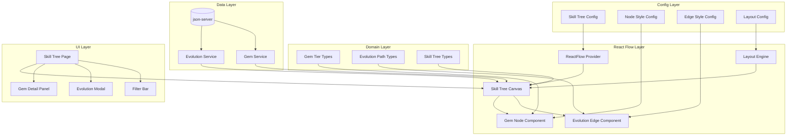

# Gem Skill Tree Design Document

## Overview

Hệ thống Gem Skill Tree sử dụng React Flow để hiển thị cây tiến hóa của gems. Gems được tổ chức theo 4 tier (Basic → Advanced → Master → Legendary) và có thể tiến hóa theo nhiều nhánh khác nhau. Hệ thống sử dụng config-driven approach để dễ dàng tùy chỉnh styling và layout. Dữ liệu được lưu trữ và truy xuất qua json-server.

## Architecture



## Components and Interfaces

### 1. Gem Tier Types (`src/features/gems/types/gemTier.ts`)

```typescript
// Gem tier enumeration
export type GemTier = "basic" | "advanced" | "master" | "legendary";

// Tier order for layout positioning
export const TIER_ORDER: Record<GemTier, number> = {
  basic: 0,
  advanced: 1,
  master: 2,
  legendary: 3,
};

// Extended Gem interface with tier
export interface TieredGem extends Gem {
  tier: GemTier;
}
```

### 2. Evolution Path Types (`src/features/gems/types/evolutionPath.ts`)

```typescript
// Evolution cost structure
export interface EvolutionCost {
  gold: number;
  materials?: Record<string, number>; // materialId -> quantity
}

// Evolution path definition
export interface EvolutionPath {
  id: string;
  sourceGemId: string;
  targetGemId: string;
  cost: EvolutionCost;
  createdAt: string;
  updatedAt: string;
}

// Evolution path form input
export interface EvolutionPathInput {
  sourceGemId: string;
  targetGemId: string;
  cost: EvolutionCost;
}
```

### 3. Skill Tree Config (`src/features/gems/config/skillTreeConfig.ts`)

```typescript
import { GemTier } from "../types/gemTier";
import { SkillType } from "../types/gem";

// Node state for styling
export type NodeState = "owned" | "available" | "locked" | "unowned";

// Tier configuration
export interface TierConfig {
  name: string;
  color: string;
  backgroundColor: string;
  xPosition: number; // Column position in layout
}

// Node style configuration
export interface NodeStyleConfig {
  width: number;
  height: number;
  borderRadius: number;
  borderWidth: number;
  states: Record<
    NodeState,
    {
      borderColor: string;
      backgroundColor: string;
      opacity: number;
      glow?: string;
    }
  >;
}

// Edge style configuration
export interface EdgeStyleConfig {
  strokeWidth: number;
  strokeColor: string;
  arrowSize: number;
  labelBackground: string;
  labelColor: string;
  animated: boolean;
}

// Layout configuration
export interface LayoutConfig {
  tierSpacing: number; // Horizontal spacing between tiers
  nodeSpacing: number; // Vertical spacing between nodes
  canvasWidth: number;
  canvasHeight: number;
  padding: number;
}

// Skill type colors for filtering
export interface SkillTypeConfig {
  color: string;
  icon: string;
  label: string;
}

// Complete skill tree configuration
export interface SkillTreeConfig {
  tiers: Record<GemTier, TierConfig>;
  nodeStyle: NodeStyleConfig;
  edgeStyle: EdgeStyleConfig;
  layout: LayoutConfig;
  skillTypes: Record<SkillType, SkillTypeConfig>;
}

// Default configuration
export const defaultSkillTreeConfig: SkillTreeConfig = {
  tiers: {
    basic: {
      name: "Basic",
      color: "#9CA3AF",
      backgroundColor: "#F3F4F6",
      xPosition: 0,
    },
    advanced: {
      name: "Advanced",
      color: "#3B82F6",
      backgroundColor: "#DBEAFE",
      xPosition: 1,
    },
    master: {
      name: "Master",
      color: "#8B5CF6",
      backgroundColor: "#EDE9FE",
      xPosition: 2,
    },
    legendary: {
      name: "Legendary",
      color: "#F59E0B",
      backgroundColor: "#FEF3C7",
      xPosition: 3,
    },
  },
  nodeStyle: {
    width: 180,
    height: 100,
    borderRadius: 12,
    borderWidth: 3,
    states: {
      owned: {
        borderColor: "#10B981",
        backgroundColor: "#D1FAE5",
        opacity: 1,
        glow: "0 0 10px rgba(16, 185, 129, 0.5)",
      },
      available: {
        borderColor: "#F59E0B",
        backgroundColor: "#FEF3C7",
        opacity: 1,
        glow: "0 0 15px rgba(245, 158, 11, 0.6)",
      },
      locked: {
        borderColor: "#6B7280",
        backgroundColor: "#E5E7EB",
        opacity: 0.5,
      },
      unowned: {
        borderColor: "#D1D5DB",
        backgroundColor: "#F9FAFB",
        opacity: 0.7,
      },
    },
  },
  edgeStyle: {
    strokeWidth: 2,
    strokeColor: "#9CA3AF",
    arrowSize: 20,
    labelBackground: "#FFFFFF",
    labelColor: "#374151",
    animated: true,
  },
  layout: {
    tierSpacing: 300,
    nodeSpacing: 150,
    canvasWidth: 1400,
    canvasHeight: 800,
    padding: 50,
  },
  skillTypes: {
    knockback: { color: "#EF4444", icon: "💥", label: "Knockback" },
    retreat: { color: "#3B82F6", icon: "🔙", label: "Retreat" },
    double_move: { color: "#10B981", icon: "⚡", label: "Double Move" },
    double_attack: { color: "#F59E0B", icon: "⚔️", label: "Double Attack" },
    execute: { color: "#7C3AED", icon: "💀", label: "Execute" },
    leap_strike: { color: "#EC4899", icon: "🦘", label: "Leap Strike" },
  },
};
```

### 4. Skill Tree Types (`src/features/gems/types/skillTree.ts`)

```typescript
import { Node, Edge } from "reactflow";
import { TieredGem } from "./gemTier";
import { EvolutionPath } from "./evolutionPath";
import { NodeState } from "../config/skillTreeConfig";

// Custom node data for React Flow
export interface GemNodeData {
  gem: TieredGem;
  state: NodeState;
  isHighlighted: boolean; // For filtering
}

// Custom edge data for React Flow
export interface EvolutionEdgeData {
  evolutionPath: EvolutionPath;
  canAfford: boolean;
}

// React Flow node type
export type GemFlowNode = Node<GemNodeData>;

// React Flow edge type
export type EvolutionFlowEdge = Edge<EvolutionEdgeData>;

// Skill tree state
export interface SkillTreeState {
  nodes: GemFlowNode[];
  edges: EvolutionFlowEdge[];
  selectedNodeId: string | null;
  filterSkillType: SkillType | null;
}
```

### 5. Evolution Service (`src/features/gems/services/evolutionService.ts`)

```typescript
import {
  EvolutionPath,
  EvolutionPathInput,
  EvolutionCost,
} from "../types/evolutionPath";
import { TieredGem, TIER_ORDER } from "../types/gemTier";

const API_BASE = "http://localhost:3001";

export interface EvolutionService {
  // CRUD operations
  getAllPaths(): Promise<EvolutionPath[]>;
  getPathById(id: string): Promise<EvolutionPath | null>;
  createPath(input: EvolutionPathInput): Promise<EvolutionPath>;
  updatePath(
    id: string,
    input: Partial<EvolutionPathInput>,
  ): Promise<EvolutionPath>;
  deletePath(id: string): Promise<void>;

  // Validation
  validatePath(sourceGem: TieredGem, targetGem: TieredGem): ValidationResult;
  checkCircularPath(
    sourceGemId: string,
    targetGemId: string,
    existingPaths: EvolutionPath[],
  ): boolean;

  // Evolution execution
  canEvolve(
    path: EvolutionPath,
    playerGold: number,
    playerMaterials: Record<string, number>,
  ): boolean;
  executeEvolution(pathId: string, playerId: string): Promise<EvolutionResult>;
}

export interface ValidationResult {
  valid: boolean;
  error?: string;
}

export interface EvolutionResult {
  success: boolean;
  newGem?: TieredGem;
  error?: string;
}
```

### 6. Layout Engine (`src/features/gems/components/skillTree/layoutEngine.ts`)

```typescript
import { TieredGem, TIER_ORDER, GemTier } from "../../types/gemTier";
import { EvolutionPath } from "../../types/evolutionPath";
import { GemFlowNode, EvolutionFlowEdge } from "../../types/skillTree";
import { SkillTreeConfig, NodeState } from "../../config/skillTreeConfig";

export interface LayoutEngine {
  // Generate node positions based on tier
  calculateNodePositions(
    gems: TieredGem[],
    config: SkillTreeConfig,
  ): Map<string, { x: number; y: number }>;

  // Convert gems to React Flow nodes
  gemsToNodes(
    gems: TieredGem[],
    ownedGemIds: Set<string>,
    availableEvolutions: Set<string>,
    config: SkillTreeConfig,
  ): GemFlowNode[];

  // Convert evolution paths to React Flow edges
  pathsToEdges(
    paths: EvolutionPath[],
    playerGold: number,
    playerMaterials: Record<string, number>,
    config: SkillTreeConfig,
  ): EvolutionFlowEdge[];

  // Determine node state
  getNodeState(
    gemId: string,
    ownedGemIds: Set<string>,
    availableEvolutions: Set<string>,
  ): NodeState;
}

// Implementation
export function calculateNodePositions(
  gems: TieredGem[],
  config: SkillTreeConfig,
): Map<string, { x: number; y: number }> {
  const positions = new Map<string, { x: number; y: number }>();

  // Group gems by tier
  const gemsByTier = new Map<GemTier, TieredGem[]>();
  for (const gem of gems) {
    const tierGems = gemsByTier.get(gem.tier) || [];
    tierGems.push(gem);
    gemsByTier.set(gem.tier, tierGems);
  }

  // Calculate positions for each tier
  for (const [tier, tierGems] of gemsByTier) {
    const tierConfig = config.tiers[tier];
    const x =
      config.layout.padding + tierConfig.xPosition * config.layout.tierSpacing;

    // Distribute nodes vertically
    const totalHeight = (tierGems.length - 1) * config.layout.nodeSpacing;
    const startY = (config.layout.canvasHeight - totalHeight) / 2;

    tierGems.forEach((gem, index) => {
      positions.set(gem.id, {
        x,
        y: startY + index * config.layout.nodeSpacing,
      });
    });
  }

  return positions;
}
```

### 7. Gem Node Component (`src/features/gems/components/skillTree/GemNode.tsx`)

```typescript
import { memo } from "react";
import { Handle, Position, NodeProps } from "reactflow";
import { GemNodeData } from "../../types/skillTree";
import { useSkillTreeConfig } from "../../hooks/useSkillTreeConfig";

export const GemNode = memo(({ data, selected }: NodeProps<GemNodeData>) => {
  const config = useSkillTreeConfig();
  const { gem, state, isHighlighted } = data;
  const stateStyle = config.nodeStyle.states[state];
  const tierConfig = config.tiers[gem.tier];
  const skillConfig = config.skillTypes[gem.skillType];

  return (
    <div
      style={{
        width: config.nodeStyle.width,
        height: config.nodeStyle.height,
        borderRadius: config.nodeStyle.borderRadius,
        border: `${config.nodeStyle.borderWidth}px solid ${stateStyle.borderColor}`,
        backgroundColor: stateStyle.backgroundColor,
        opacity: isHighlighted ? stateStyle.opacity : 0.3,
        boxShadow: stateStyle.glow,
        padding: "8px",
        display: "flex",
        flexDirection: "column",
      }}
    >
      <Handle type="target" position={Position.Left} />

      {/* Tier badge */}
      <div style={{
        backgroundColor: tierConfig.color,
        color: "white",
        padding: "2px 8px",
        borderRadius: "4px",
        fontSize: "10px",
        alignSelf: "flex-start",
      }}>
        {tierConfig.name}
      </div>

      {/* Gem name */}
      <div style={{ fontWeight: "bold", marginTop: "4px" }}>
        {gem.name}
      </div>

      {/* Skill type */}
      <div style={{
        display: "flex",
        alignItems: "center",
        gap: "4px",
        color: skillConfig.color,
        fontSize: "12px",
      }}>
        <span>{skillConfig.icon}</span>
        <span>{skillConfig.label}</span>
      </div>

      {/* Activation chance */}
      <div style={{ fontSize: "11px", color: "#6B7280" }}>
        {gem.activationChance}% chance
      </div>

      <Handle type="source" position={Position.Right} />
    </div>
  );
});
```

### 8. Evolution Edge Component (`src/features/gems/components/skillTree/EvolutionEdge.tsx`)

```typescript
import { memo } from "react";
import { EdgeProps, getBezierPath, EdgeLabelRenderer } from "reactflow";
import { EvolutionEdgeData } from "../../types/skillTree";
import { useSkillTreeConfig } from "../../hooks/useSkillTreeConfig";

export const EvolutionEdge = memo(({
  id,
  sourceX,
  sourceY,
  targetX,
  targetY,
  sourcePosition,
  targetPosition,
  data,
}: EdgeProps<EvolutionEdgeData>) => {
  const config = useSkillTreeConfig();
  const { evolutionPath, canAfford } = data!;

  const [edgePath, labelX, labelY] = getBezierPath({
    sourceX,
    sourceY,
    sourcePosition,
    targetX,
    targetY,
    targetPosition,
  });

  return (
    <>
      <path
        id={id}
        d={edgePath}
        stroke={canAfford ? "#10B981" : config.edgeStyle.strokeColor}
        strokeWidth={config.edgeStyle.strokeWidth}
        fill="none"
        markerEnd="url(#arrow)"
      />
      <EdgeLabelRenderer>
        <div
          style={{
            position: "absolute",
            transform: `translate(-50%, -50%) translate(${labelX}px,${labelY}px)`,
            background: config.edgeStyle.labelBackground,
            padding: "4px 8px",
            borderRadius: "4px",
            fontSize: "12px",
            color: canAfford ? "#10B981" : "#EF4444",
            border: "1px solid #E5E7EB",
          }}
        >
          💰 {evolutionPath.cost.gold}
        </div>
      </EdgeLabelRenderer>
    </>
  );
});
```

### 9. Skill Tree Canvas (`src/features/gems/components/skillTree/SkillTreeCanvas.tsx`)

```typescript
import { useCallback, useMemo } from "react";
import ReactFlow, {
  Background,
  Controls,
  MiniMap,
  useNodesState,
  useEdgesState,
  NodeTypes,
  EdgeTypes,
} from "reactflow";
import "reactflow/dist/style.css";

import { GemNode } from "./GemNode";
import { EvolutionEdge } from "./EvolutionEdge";
import { useSkillTreeData } from "../../hooks/useSkillTreeData";
import { useSkillTreeConfig } from "../../hooks/useSkillTreeConfig";
import { SkillType } from "../../types/gem";

const nodeTypes: NodeTypes = {
  gemNode: GemNode,
};

const edgeTypes: EdgeTypes = {
  evolutionEdge: EvolutionEdge,
};

interface SkillTreeCanvasProps {
  filterSkillType: SkillType | null;
  onNodeClick: (gemId: string) => void;
}

export function SkillTreeCanvas({ filterSkillType, onNodeClick }: SkillTreeCanvasProps) {
  const config = useSkillTreeConfig();
  const { nodes: initialNodes, edges: initialEdges, isLoading } = useSkillTreeData(filterSkillType);

  const [nodes, setNodes, onNodesChange] = useNodesState(initialNodes);
  const [edges, setEdges, onEdgesChange] = useEdgesState(initialEdges);

  const handleNodeClick = useCallback((event: React.MouseEvent, node: any) => {
    onNodeClick(node.id);
  }, [onNodeClick]);

  if (isLoading) {
    return <div>Loading skill tree...</div>;
  }

  return (
    <div style={{ width: config.layout.canvasWidth, height: config.layout.canvasHeight }}>
      <ReactFlow
        nodes={nodes}
        edges={edges}
        onNodesChange={onNodesChange}
        onEdgesChange={onEdgesChange}
        onNodeClick={handleNodeClick}
        nodeTypes={nodeTypes}
        edgeTypes={edgeTypes}
        fitView
        attributionPosition="bottom-left"
      >
        <Background />
        <Controls />
        <MiniMap />
      </ReactFlow>
    </div>
  );
}
```

## Data Models

### Database Schema (db.json additions)

```json
{
  "gems": [
    {
      "id": "gem-basic-knockback",
      "name": "Knockback Stone",
      "tier": "basic",
      "skillType": "knockback",
      "trigger": "combat",
      "activationChance": 20,
      "cooldown": 0,
      "effectParams": { "knockbackDistance": 1 }
    },
    {
      "id": "gem-advanced-knockback",
      "name": "Force Stone",
      "tier": "advanced",
      "skillType": "knockback",
      "trigger": "combat",
      "activationChance": 35,
      "cooldown": 0,
      "effectParams": { "knockbackDistance": 1 }
    }
  ],
  "evolutionPaths": [
    {
      "id": "evo-1",
      "sourceGemId": "gem-basic-knockback",
      "targetGemId": "gem-advanced-knockback",
      "cost": { "gold": 500 },
      "createdAt": "2025-01-01T00:00:00Z",
      "updatedAt": "2025-01-01T00:00:00Z"
    }
  ],
  "playerGems": [
    {
      "playerId": "player-1",
      "gemIds": ["gem-basic-knockback"]
    }
  ]
}
```

## Correctness Properties

_A property is a characteristic or behavior that should hold true across all valid executions of a system-essentially, a formal statement about what the system should do. Properties serve as the bridge between human-readable specifications and machine-verifiable correctness guarantees._

### Property 1: Gem Tier Default Assignment

_For any_ gem created without an explicit tier, the Gem_System should assign tier "basic" as the default value.
**Validates: Requirements 1.2**

### Property 2: Gem Tier Persistence Round Trip

_For any_ valid tiered gem, creating the gem and then retrieving it by ID should return a gem with the same tier value.
**Validates: Requirements 1.4**

### Property 3: Evolution Path Round Trip

_For any_ valid evolution path input (source gem, target gem, cost), creating the path and retrieving it should return an equivalent path with all fields matching.
**Validates: Requirements 2.1**

### Property 4: Evolution Path Tier Validation

_For any_ pair of gems where source tier >= target tier (according to TIER_ORDER), the Evolution_System should reject the evolution path creation.
**Validates: Requirements 2.2**

### Property 5: Evolution Path Deletion Isolation

_For any_ evolution path that is deleted, the source and target gems should still exist in the database unchanged.
**Validates: Requirements 2.3**

### Property 6: Multiple Evolution Paths from Source

_For any_ source gem, the Evolution_System should allow creating multiple evolution paths to different target gems.
**Validates: Requirements 2.4**

### Property 7: Circular Path Prevention

_For any_ sequence of evolution paths that would form a cycle (A→B→C→A), the Evolution_System should reject the path that completes the cycle.
**Validates: Requirements 2.5**

### Property 8: Node Generation Count

_For any_ set of gems, the layout engine should generate exactly one React Flow node per gem.
**Validates: Requirements 3.1**

### Property 9: Node Position by Tier

_For any_ two gems where gem1.tier < gem2.tier (in TIER_ORDER), the x-position of gem1's node should be less than gem2's node x-position.
**Validates: Requirements 3.2**

### Property 10: Edge Source/Target Mapping

_For any_ evolution path, the generated React Flow edge should have source ID equal to sourceGemId and target ID equal to targetGemId.
**Validates: Requirements 3.3**

### Property 11: Node State Determination

_For any_ gem and ownership state:

- If gem is in ownedGemIds AND has available evolution → state is "available"
- If gem is in ownedGemIds AND no available evolution → state is "owned"
- If gem is NOT in ownedGemIds AND has owned prerequisite → state is "locked"
- If gem is NOT in ownedGemIds AND no owned prerequisite → state is "unowned"
  **Validates: Requirements 4.1, 4.2, 4.3, 4.4**

### Property 12: Evolution Execution Invariants

_For any_ successful evolution:

- Player gold should decrease by exactly the evolution cost
- Target gem should appear in player's gem list
- Source gem should be removed from player's gem list
  **Validates: Requirements 5.1, 5.2, 5.3**

### Property 13: Evolution Resource Validation

_For any_ evolution attempt where player gold < evolution cost, the Evolution_System should reject the evolution and leave player state unchanged.
**Validates: Requirements 5.4**

### Property 14: Skill Type Filtering

_For any_ skill type filter and set of gems:

- Gems matching the filter skill type should have isHighlighted = true
- Gems not matching should have isHighlighted = false
- When filter is null, all gems should have isHighlighted = true
  **Validates: Requirements 6.1, 6.2, 6.3**

### Property 15: Edge Cost Affordability

_For any_ evolution path and player gold:

- If player gold >= path cost → canAfford is true
- If player gold < path cost → canAfford is false
  **Validates: Requirements 7.3, 7.4**

### Property 16: Layout Tier Grouping

_For any_ set of gems, all gems of the same tier should have the same x-position in the layout.
**Validates: Requirements 9.1**

### Property 17: Layout Vertical Distribution

_For any_ tier with multiple gems, the y-positions should be evenly distributed with spacing equal to config.layout.nodeSpacing.
**Validates: Requirements 9.2, 9.4**

## Error Handling

| Error Case                             | Handling Strategy                                     |
| -------------------------------------- | ----------------------------------------------------- |
| Evolution path with invalid tier order | Return validation error, no state change              |
| Circular evolution path detected       | Return validation error, no state change              |
| Evolution with insufficient gold       | Return error, no state change                         |
| Non-existent gem in evolution path     | Return error, no state change                         |
| json-server connection failure         | Display error message, retry with exponential backoff |
| Invalid config values                  | Fall back to default config values                    |

## Testing Strategy

### Property-Based Testing Library

- **fast-check** for TypeScript property-based testing

### Unit Tests

- Gem tier assignment and persistence
- Evolution path CRUD operations
- Layout position calculations
- Node state determination logic
- Filter highlighting logic
- Cost affordability calculations

### Property-Based Tests

Each correctness property will be implemented as a property-based test using fast-check:

1. **Tier Default**: Generate gem inputs without tier, verify default assignment
2. **Tier Round Trip**: Generate tiered gems, create/retrieve, verify tier preserved
3. **Path Round Trip**: Generate valid path inputs, create/retrieve, verify equality
4. **Tier Validation**: Generate gem pairs, verify validation rejects invalid tier orders
5. **Deletion Isolation**: Create path, delete, verify gems unchanged
6. **Multiple Paths**: Generate multiple targets, verify all paths stored
7. **Circular Prevention**: Generate path sequences, verify cycles rejected
8. **Node Count**: Generate gem sets, verify node count matches
9. **Position by Tier**: Generate gem pairs, verify x-position ordering
10. **Edge Mapping**: Generate paths, verify edge source/target IDs
11. **Node State**: Generate ownership scenarios, verify state determination
12. **Evolution Execution**: Generate valid evolutions, verify invariants
13. **Resource Validation**: Generate insufficient gold scenarios, verify rejection
14. **Filtering**: Generate filter scenarios, verify highlighting
15. **Affordability**: Generate gold/cost pairs, verify canAfford
16. **Tier Grouping**: Generate multi-tier gems, verify x-position grouping
17. **Vertical Distribution**: Generate same-tier gems, verify y-spacing

### Test Annotations

Each property-based test MUST be tagged with:

```typescript
// **Feature: gem-skill-tree, Property {number}: {property_text}**
```

### Test Configuration

- Minimum 100 iterations per property test
- Use fast-check's `fc.assert` with `{ numRuns: 100 }`
