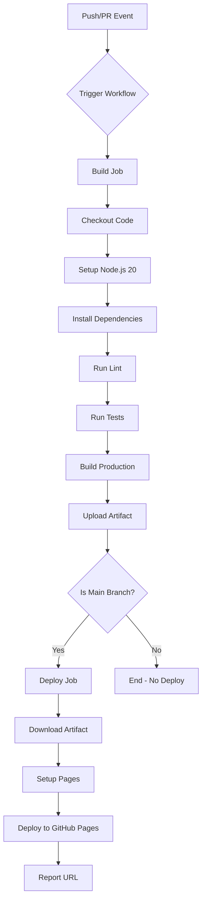

# Design Document: GitHub Actions CI/CD

## Overview

Thiết kế CI/CD pipeline sử dụng GitHub Actions để tự động hóa quá trình build, test, lint và deploy ứng dụng React/Vite lên GitHub Pages. Pipeline được thiết kế với 2 jobs chính: `build` (chạy trên mọi push/PR) và `deploy` (chỉ chạy trên main branch sau khi build thành công).

## Architecture



## Components and Interfaces

### Workflow File Structure

```
.github/
└── workflows/
    └── ci-cd.yml          # Main CI/CD workflow
```

### Job Dependencies

| Job    | Depends On | Runs On       | Condition                |
| ------ | ---------- | ------------- | ------------------------ |
| build  | -          | ubuntu-latest | Always (push/PR to main) |
| deploy | build      | ubuntu-latest | Only on main branch push |

### GitHub Actions Used

| Action                        | Version | Purpose                   |
| ----------------------------- | ------- | ------------------------- |
| actions/checkout              | v4      | Checkout repository code  |
| actions/setup-node            | v4      | Setup Node.js environment |
| actions/upload-pages-artifact | v3      | Upload build artifacts    |
| actions/deploy-pages          | v4      | Deploy to GitHub Pages    |
| actions/configure-pages       | v5      | Configure GitHub Pages    |

## Data Models

### Workflow Configuration Schema

```yaml
name: string # Workflow name
on: # Trigger events
  push:
    branches: [main]
  pull_request:
    branches: [main]

permissions: # Required permissions
  contents: read
  pages: write
  id-token: write

concurrency: # Prevent concurrent deployments
  group: string
  cancel-in-progress: boolean

jobs:
  build: # Build job configuration
    runs-on: string
    steps: Step[]
  deploy: # Deploy job configuration
    needs: string[]
    if: string # Condition for deployment
    runs-on: string
    environment:
      name: string
      url: string
    steps: Step[]
```

### Environment Variables

| Variable     | Source   | Usage                               |
| ------------ | -------- | ----------------------------------- |
| GITHUB_TOKEN | GitHub   | Authentication for Pages deployment |
| NODE_VERSION | Workflow | Node.js version (20)                |

## Correctness Properties

_A property is a characteristic or behavior that should hold true across all valid executions of a system-essentially, a formal statement about what the system should do. Properties serve as the bridge between human-readable specifications and machine-verifiable correctness guarantees._

Based on the prework analysis, most acceptance criteria for this feature are configuration validations that can be verified through example-based testing rather than property-based testing. The CI/CD workflow is primarily a declarative YAML configuration, and the actual execution behavior is handled by GitHub Actions runtime.

### Testable Examples (Configuration Validation)

The following can be validated by parsing and inspecting the workflow YAML file:

1. **Workflow triggers are correctly configured** - Verify push and pull_request triggers target main branch
2. **Node.js setup is correct** - Verify setup-node action uses version 20 with npm caching
3. **Build steps are in correct order** - Verify lint → test → build sequence
4. **Deploy job has correct conditions** - Verify deploy only runs on main branch
5. **Required actions are present** - Verify checkout, setup-node, upload-pages-artifact, deploy-pages actions exist

### Non-Testable Behaviors

The following are handled by GitHub Actions runtime and cannot be unit tested:

- Actual caching behavior
- Step failure propagation
- Deployment execution
- Error output formatting

**Validates: Requirements 1.1-1.3, 2.1-2.2, 3.1, 4.1, 5.1, 5.4, 6.1-6.4, 7.1-7.3, 8.1**

## Error Handling

### Build Failures

| Error Type        | Handling                      | User Feedback                  |
| ----------------- | ----------------------------- | ------------------------------ |
| Lint errors       | Workflow fails at lint step   | ESLint error output in logs    |
| Test failures     | Workflow fails at test step   | Vitest failure report in logs  |
| Build errors      | Workflow fails at build step  | TypeScript/Vite errors in logs |
| Deployment errors | Workflow fails at deploy step | GitHub Pages error in logs     |

### Recovery Strategies

1. **Failed PR checks**: Developer fixes issues and pushes new commit
2. **Failed deployment**: Automatic retry on next push to main
3. **Concurrent deployments**: Cancelled by concurrency group setting

## Testing Strategy

### Manual Testing

Since this is a CI/CD configuration, testing is primarily done through:

1. **Dry run validation**: Push to a feature branch to verify build/test steps
2. **PR validation**: Create PR to verify workflow triggers correctly
3. **Deployment validation**: Merge to main to verify full pipeline

### Configuration Validation

The workflow YAML can be validated using:

- GitHub Actions workflow syntax checker (built into GitHub)
- `actionlint` tool for local validation

### Integration Testing

1. Create a test branch with intentional lint error → verify workflow fails
2. Create a test branch with failing test → verify workflow fails
3. Create a test branch with build error → verify workflow fails
4. Merge clean code to main → verify deployment succeeds

### Vite Configuration for GitHub Pages

Update `vite.config.ts` to support GitHub Pages base path:

```typescript
export default defineConfig({
  base: process.env.GITHUB_PAGES ? "/repository-name/" : "/",
  // ... other config
});
```

Or use the repository name directly if deploying to `username.github.io/repo-name/`.
