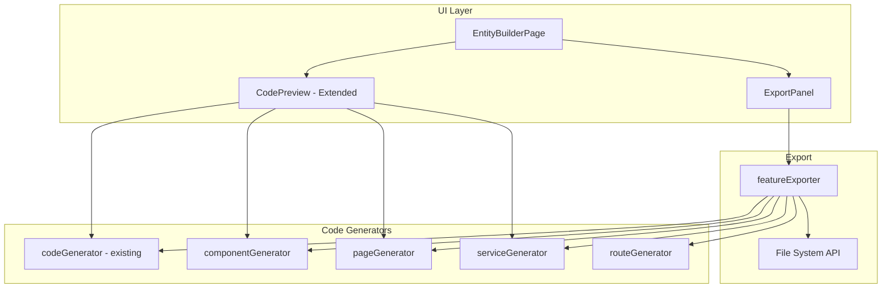

# Design Document: Low-Code Builder V2

## Overview

Nâng cấp Low-Code Builder để sinh code thật ra file và tạo React components hoàn chỉnh. Hệ thống sẽ tạo feature folder với types, components, pages, services có thể chạy được ngay.

## Architecture



## Components and Interfaces

### Extended Code Generators

```typescript
// services/componentGenerator.ts

/**
 * Generates Form component code
 */
function generateFormComponent(entity: EntityDefinition): string;

/**
 * Generates Card component code
 */
function generateCardComponent(entity: EntityDefinition): string;

/**
 * Generates List component code
 */
function generateListComponent(entity: EntityDefinition): string;
```

```typescript
// services/pageGenerator.ts

/**
 * Generates ListPage component code
 */
function generateListPage(entity: EntityDefinition): string;

/**
 * Generates CreatePage component code
 */
function generateCreatePage(entity: EntityDefinition): string;

/**
 * Generates EditPage component code
 */
function generateEditPage(entity: EntityDefinition): string;
```

```typescript
// services/serviceGenerator.ts

/**
 * Generates service file with CRUD operations
 */
function generateService(entity: EntityDefinition): string;
```

```typescript
// services/featureExporter.ts

interface ExportResult {
  success: boolean;
  files: string[];
  error?: string;
}

interface GeneratedFile {
  path: string;
  content: string;
}

/**
 * Generates all files for a feature
 */
function generateFeatureFiles(entity: EntityDefinition): GeneratedFile[];

/**
 * Exports feature to file system
 * Note: In browser, this will use download or show copy dialog
 */
function exportFeature(entity: EntityDefinition): Promise<ExportResult>;
```

### UI Components

#### Extended CodePreview

```typescript
interface CodePreviewProps {
  entityDefinition: EntityDefinition;
}

// Tabs: Interface | Schema | Form | Card | List | ListPage | Service
```

#### ExportPanel

```typescript
interface ExportPanelProps {
  entityDefinition: EntityDefinition;
  onExport: () => void;
}

// Shows:
// - Feature folder structure preview
// - Export button
// - Route configuration to copy
// - Success/error messages
```

## Data Models

### Generated File Structure

```
src/features/{entityName}/
├── types/
│   └── {entity}.ts          # Interface + Schema
├── components/
│   ├── {Entity}Form.tsx     # Form component
│   ├── {Entity}Card.tsx     # Card component
│   ├── {Entity}List.tsx     # List component
│   └── index.ts             # Component exports
├── pages/
│   ├── {Entity}ListPage.tsx
│   ├── {Entity}CreatePage.tsx
│   ├── {Entity}EditPage.tsx
│   └── index.ts
├── services/
│   ├── {entity}Service.ts
│   └── index.ts
└── index.ts                  # Feature exports
```

### Code Templates

#### Form Component Template

```typescript
// Template for {Entity}Form.tsx
import { useForm } from "react-hook-form";
import { zodResolver } from "@hookform/resolvers/zod";
import { Button } from "@/components/ui/button";
import { Input } from "@/components/ui/input";
import { Switch } from "@/components/ui/switch";
import { Select, SelectContent, SelectItem, SelectTrigger, SelectValue } from "@/components/ui/select";
import { Form, FormControl, FormField, FormItem, FormLabel, FormMessage } from "@/components/ui/form";
import { {Entity}, {entity}Schema } from "../types/{entity}";

interface {Entity}FormProps {
  defaultValues?: Partial<{Entity}>;
  onSubmit: (data: {Entity}) => void;
  isLoading?: boolean;
}

export function {Entity}Form({ defaultValues, onSubmit, isLoading }: {Entity}FormProps) {
  const form = useForm<{Entity}>({
    resolver: zodResolver({entity}Schema),
    defaultValues: defaultValues || {/* field defaults */},
  });

  return (
    <Form {...form}>
      <form onSubmit={form.handleSubmit(onSubmit)} className="space-y-4">
        {/* Generated form fields */}
        <Button type="submit" disabled={isLoading}>
          {isLoading ? "Saving..." : "Save"}
        </Button>
      </form>
    </Form>
  );
}
```

#### Service Template

```typescript
// Template for {entity}Service.ts
import type { {Entity} } from "../types/{entity}";

const STORAGE_KEY = "{entity}-data";

export function getAll{Entity}s(): {Entity}[] {
  const data = localStorage.getItem(STORAGE_KEY);
  return data ? JSON.parse(data) : [];
}

export function get{Entity}ById(id: string): {Entity} | undefined {
  return getAll{Entity}s().find(item => item.id === id);
}

export function create{Entity}(data: Omit<{Entity}, "id">): {Entity} {
  const items = getAll{Entity}s();
  const newItem = { ...data, id: crypto.randomUUID() };
  localStorage.setItem(STORAGE_KEY, JSON.stringify([...items, newItem]));
  return newItem;
}

export function update{Entity}(id: string, data: Partial<{Entity}>): {Entity} | undefined {
  const items = getAll{Entity}s();
  const index = items.findIndex(item => item.id === id);
  if (index === -1) return undefined;
  items[index] = { ...items[index], ...data };
  localStorage.setItem(STORAGE_KEY, JSON.stringify(items));
  return items[index];
}

export function delete{Entity}(id: string): boolean {
  const items = getAll{Entity}s();
  const filtered = items.filter(item => item.id !== id);
  if (filtered.length === items.length) return false;
  localStorage.setItem(STORAGE_KEY, JSON.stringify(filtered));
  return true;
}
```

## Correctness Properties

_A property is a characteristic or behavior that should hold true across all valid executions of a system—essentially, a formal statement about what the system should do._

### Property 1: All Component Types Generated

_For any_ valid EntityDefinition, the component generator SHALL produce Form, Card, and List component code strings that are non-empty and contain the entity name.

**Validates: Requirements 1.1, 1.2, 1.3**

### Property 2: Components Use shadcn/ui

_For any_ valid EntityDefinition, all generated component code SHALL contain imports from `@/components/ui/`.

**Validates: Requirements 1.4**

### Property 3: All Page Types Generated

_For any_ valid EntityDefinition, the page generator SHALL produce ListPage, CreatePage, and EditPage code strings that contain AppLayout import.

**Validates: Requirements 2.1, 2.2, 2.3, 2.4**

### Property 4: Service Has Complete CRUD

_For any_ valid EntityDefinition, the generated service code SHALL contain all CRUD function names (getAll, getById, create, update, delete) and localStorage references.

**Validates: Requirements 3.1, 3.2, 3.3**

### Property 5: Export Generates All Required Files

_For any_ valid EntityDefinition, the feature exporter SHALL generate files for: types, components (Form, Card, List), pages (List, Create, Edit), services, and index files.

**Validates: Requirements 4.1, 4.2, 4.3, 4.4, 4.5**

### Property 6: Route Configuration Generated

_For any_ valid EntityDefinition, the route generator SHALL produce route configuration code that includes paths for list, create, and edit pages.

**Validates: Requirements 6.1, 6.2**

## Error Handling

| Error Case                | Handling                              |
| ------------------------- | ------------------------------------- |
| Empty entity name         | Disable export, show validation error |
| No fields defined         | Disable export, show warning          |
| Invalid field keys        | Show inline error on field            |
| Export failure            | Show error toast with details         |
| Clipboard API unavailable | Fallback to select-all text           |

## Testing Strategy

### Unit Tests

- Test `generateFormComponent()` produces valid JSX structure
- Test `generateCardComponent()` includes all field displays
- Test `generateListComponent()` includes proper mapping
- Test `generateService()` includes all CRUD functions
- Test `generateFeatureFiles()` creates correct file list

### Property-Based Tests

Using `fast-check`:

1. **All Components Generated Property** (Property 1)
   - Generate random EntityDefinitions
   - Verify Form, Card, List code strings are non-empty
   - Verify entity name appears in generated code
   - Minimum 100 iterations

2. **shadcn/ui Imports Property** (Property 2)
   - Generate random EntityDefinitions
   - Check all component code contains @/components/ui/ imports
   - Minimum 100 iterations

3. **All Pages Generated Property** (Property 3)
   - Generate random EntityDefinitions
   - Verify ListPage, CreatePage, EditPage are generated
   - Verify AppLayout import is present
   - Minimum 100 iterations

4. **Service CRUD Property** (Property 4)
   - Generate random EntityDefinitions
   - Check generated service contains all CRUD function names
   - Check localStorage references
   - Minimum 100 iterations

5. **File Structure Property** (Property 5)
   - Generate random EntityDefinitions
   - Verify all expected files are generated
   - Verify file paths follow naming convention
   - Minimum 100 iterations

6. **Route Config Property** (Property 6)
   - Generate random EntityDefinitions
   - Verify route config contains list, create, edit paths
   - Minimum 100 iterations
