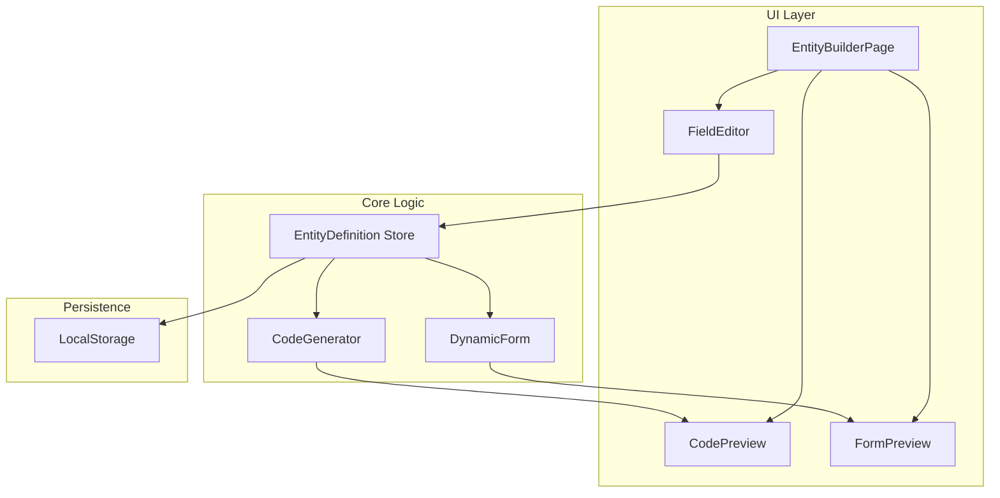

# Design Document: Low-Code Builder MVP

## Overview

Low-Code Builder MVP là một feature cho phép developers tạo entity definitions thông qua UI, tự động sinh TypeScript types, Zod schemas và preview form động. Hệ thống tận dụng patterns có sẵn trong project (như `STAT_REGISTRY`, `schemaGenerator`) và sử dụng shadcn/ui components.

## Architecture



## Components and Interfaces

### Core Types

```typescript
// Field type options
type FieldType = "text" | "number" | "select" | "boolean";

// Single field definition
interface FieldDefinition {
  id: string; // Unique ID (uuid)
  key: string; // Field key (camelCase)
  label: string; // Display label
  type: FieldType; // Field type
  required: boolean; // Is required
  // Type-specific options
  options?: {
    // For text
    minLength?: number;
    maxLength?: number;
    // For number
    min?: number;
    max?: number;
    step?: number;
    // For select
    choices?: { value: string; label: string }[];
  };
}

// Complete entity definition
interface EntityDefinition {
  id: string; // Unique ID
  name: string; // Entity name (PascalCase)
  fields: FieldDefinition[];
  createdAt: number;
  updatedAt: number;
}
```

### UI Components

#### EntityBuilderPage

- Main page component
- Layout: 2-column (Editor | Preview)
- Contains: EntityNameInput, FieldList, AddFieldButton, SaveButton

#### FieldEditor

- Edits a single field definition
- Props: `field: FieldDefinition`, `onChange`, `onRemove`
- Shows: key input, label input, type selector, required toggle, type-specific options

#### CodePreview

- Displays generated TypeScript code
- Props: `entityDefinition: EntityDefinition`
- Tabs: Interface | Schema
- Copy button for each tab

#### FormPreview

- Renders dynamic form from entity definition
- Props: `entityDefinition: EntityDefinition`
- Shows validation errors on submit
- Displays submitted data as JSON

### Code Generator

```typescript
// Generate TypeScript interface string
function generateInterface(entity: EntityDefinition): string;

// Generate Zod schema string
function generateZodSchema(entity: EntityDefinition): string;

// Generate runtime Zod schema object (for form validation)
function createRuntimeSchema(entity: EntityDefinition): z.ZodObject<any>;
```

### Dynamic Form

```typescript
interface DynamicFormProps {
  entityDefinition: EntityDefinition;
  onSubmit: (data: Record<string, unknown>) => void;
}

// Renders form dynamically based on entity definition
function DynamicForm({
  entityDefinition,
  onSubmit,
}: DynamicFormProps): JSX.Element;
```

## Data Models

### EntityDefinition Storage

```typescript
// localStorage key
const STORAGE_KEY = "lowcode-entities";

// Storage format
interface StoredEntities {
  entities: EntityDefinition[];
  version: number;
}
```

### Field Type Mapping

| FieldType | TypeScript | Zod Schema      | UI Component              |
| --------- | ---------- | --------------- | ------------------------- |
| text      | `string`   | `z.string()`    | `<Input />`               |
| number    | `number`   | `z.number()`    | `<Input type="number" />` |
| select    | `string`   | `z.enum([...])` | `<Select />`              |
| boolean   | `boolean`  | `z.boolean()`   | `<Switch />`              |

## Correctness Properties

_A property is a characteristic or behavior that should hold true across all valid executions of a system—essentially, a formal statement about what the system should do. Properties serve as the bridge between human-readable specifications and machine-verifiable correctness guarantees._

### Property 1: Add Field Increases Count

_For any_ EntityDefinition with N fields, when a user adds a new field, the resulting EntityDefinition SHALL have N+1 fields.

**Validates: Requirements 1.2**

### Property 2: Remove Field Decreases Count

_For any_ EntityDefinition with N fields (N > 0), when a user removes a field, the resulting EntityDefinition SHALL have N-1 fields, and the removed field SHALL NOT be present.

**Validates: Requirements 1.4**

### Property 3: Field Changes Update Definition

_For any_ FieldDefinition and any valid update (key, label, type, required, options), the EntityDefinition SHALL reflect the updated values exactly.

**Validates: Requirements 1.3**

### Property 4: Interface Generation Produces Valid TypeScript

_For any_ valid EntityDefinition, the generated TypeScript interface string SHALL:

- Contain the entity name as interface name
- Contain all field keys with correct types
- Be syntactically valid TypeScript

**Validates: Requirements 2.1**

### Property 5: Schema Generation Produces Valid Zod

_For any_ valid EntityDefinition, the generated Zod schema string SHALL:

- Contain all field keys with correct Zod types
- Include validation constraints (min, max, required)
- Be syntactically valid Zod code

**Validates: Requirements 2.2**

### Property 6: Schema Round-Trip Validation (KEY PROPERTY)

_For any_ valid EntityDefinition and any data object:

- If data matches the schema constraints, validation SHALL pass
- If data violates any constraint, validation SHALL fail with appropriate error
- Creating a runtime schema from the definition and validating sample data SHALL produce consistent results

**Validates: Requirements 2.3**

### Property 7: Dynamic Form Renders and Validates

_For any_ valid EntityDefinition:

- The DynamicForm SHALL render exactly N form fields for N field definitions
- Submitting valid data SHALL succeed and return the data
- Submitting invalid data SHALL show validation errors

**Validates: Requirements 3.1, 3.2, 3.3**

### Property 8: Persistence Round-Trip

_For any_ valid EntityDefinition, saving then loading SHALL produce an equivalent EntityDefinition (same name, same fields with same properties).

**Validates: Requirements 4.1, 4.3**

### Property 9: Delete Removes From Storage

_For any_ saved EntityDefinition, after deletion, the entity SHALL NOT be retrievable from storage.

**Validates: Requirements 4.4**

## Error Handling

### Input Validation Errors

| Error Case                             | Handling                             |
| -------------------------------------- | ------------------------------------ |
| Empty entity name                      | Show inline error, disable save      |
| Duplicate field keys                   | Show inline error on duplicate field |
| Empty field key                        | Show inline error, disable save      |
| Invalid number constraints (min > max) | Show inline error                    |
| Empty select choices                   | Show inline error                    |

### Runtime Errors

| Error Case                | Handling                           |
| ------------------------- | ---------------------------------- |
| localStorage full         | Show toast error, suggest export   |
| Invalid stored data       | Reset to empty state, show warning |
| Schema generation failure | Show error in CodePreview          |

## Testing Strategy

### Unit Tests

- Test `generateInterface()` with various entity definitions
- Test `generateZodSchema()` with various entity definitions
- Test `createRuntimeSchema()` produces working Zod schemas
- Test field type mapping (text → string, number → number, etc.)
- Test localStorage service (save, load, delete)

### Property-Based Tests

Using `fast-check` library (already in project):

1. **Schema Round-Trip Property** (Property 6)
   - Generate random EntityDefinitions
   - Create runtime schema
   - Generate valid/invalid test data
   - Verify validation results match expectations
   - Minimum 100 iterations

2. **Persistence Round-Trip Property** (Property 8)
   - Generate random EntityDefinitions
   - Save to localStorage
   - Load from localStorage
   - Verify equality
   - Minimum 100 iterations

3. **Add/Remove Field Properties** (Properties 1, 2)
   - Generate random EntityDefinitions
   - Add random fields, verify count increases
   - Remove random fields, verify count decreases
   - Minimum 100 iterations

### Integration Tests

- Test EntityBuilderPage renders correctly
- Test field add/remove UI interactions
- Test code copy to clipboard
- Test form preview with validation
