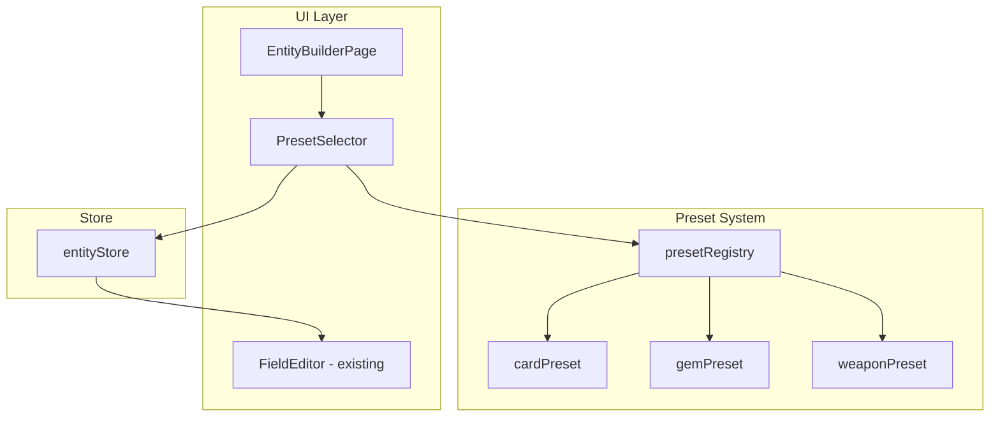

# Design Document: Game Entity Presets

## Overview

Thêm hệ thống Presets vào Low-Code Builder cho phép tạo nhanh entity definitions dựa trên các game entity có sẵn (Card, Gem, Weapon). User chọn preset → fields được populate tự động → user có thể customize thêm.

## Architecture



## Components and Interfaces

### Preset Types

```typescript
// types/presets.ts

/**
 * Available preset types
 */
export type PresetType = "none" | "card" | "gem" | "weapon";

/**
 * Preset definition structure
 */
export interface PresetDefinition {
  type: PresetType;
  label: string;
  description: string;
  defaultEntityName: string;
  fields: FieldDefinition[];
}
```

### Preset Registry

```typescript
// presets/presetRegistry.ts

/**
 * Get all available presets
 */
function getPresets(): PresetDefinition[];

/**
 * Get a specific preset by type
 */
function getPreset(type: PresetType): PresetDefinition | undefined;

/**
 * Apply preset to entity store
 */
function applyPreset(type: PresetType): FieldDefinition[];
```

### Card Preset Definition

```typescript
// presets/cardPreset.ts

export const cardPreset: PresetDefinition = {
  type: "card",
  label: "Card-like",
  description: "Combat entity with HP, ATK, DEF, SPD and offensive stats",
  defaultEntityName: "BattleUnit",
  fields: [
    { id: "f1", key: "name", label: "Name", type: "text", required: true },
    {
      id: "f2",
      key: "hp",
      label: "HP",
      type: "number",
      required: true,
      options: { min: 1, max: 99999 },
    },
    {
      id: "f3",
      key: "atk",
      label: "Attack",
      type: "number",
      required: true,
      options: { min: 0, max: 9999 },
    },
    {
      id: "f4",
      key: "def",
      label: "Defense",
      type: "number",
      required: true,
      options: { min: 0, max: 9999 },
    },
    {
      id: "f5",
      key: "spd",
      label: "Speed",
      type: "number",
      required: true,
      options: { min: 0, max: 9999 },
    },
    {
      id: "f6",
      key: "critChance",
      label: "Crit Chance",
      type: "number",
      required: false,
      options: { min: 0, max: 100 },
    },
    {
      id: "f7",
      key: "critDamage",
      label: "Crit Damage",
      type: "number",
      required: false,
      options: { min: 0, max: 500 },
    },
    {
      id: "f8",
      key: "armorPen",
      label: "Armor Pen",
      type: "number",
      required: false,
      options: { min: 0, max: 100 },
    },
    {
      id: "f9",
      key: "lifesteal",
      label: "Lifesteal",
      type: "number",
      required: false,
      options: { min: 0, max: 100 },
    },
    {
      id: "f10",
      key: "imagePath",
      label: "Image Path",
      type: "text",
      required: false,
    },
  ],
};
```

### Gem Preset Definition

```typescript
// presets/gemPreset.ts

export const gemPreset: PresetDefinition = {
  type: "gem",
  label: "Gem-like",
  description:
    "Skill-based entity with trigger, cooldown and activation chance",
  defaultEntityName: "SkillGem",
  fields: [
    { id: "f1", key: "name", label: "Name", type: "text", required: true },
    {
      id: "f2",
      key: "description",
      label: "Description",
      type: "text",
      required: false,
    },
    {
      id: "f3",
      key: "skillType",
      label: "Skill Type",
      type: "select",
      required: true,
      options: {
        choices: [
          { value: "knockback", label: "Knockback" },
          { value: "retreat", label: "Retreat" },
          { value: "double_move", label: "Double Move" },
          { value: "double_attack", label: "Double Attack" },
          { value: "execute", label: "Execute" },
          { value: "leap_strike", label: "Leap Strike" },
        ],
      },
    },
    {
      id: "f4",
      key: "trigger",
      label: "Trigger",
      type: "select",
      required: true,
      options: {
        choices: [
          { value: "movement", label: "Movement" },
          { value: "combat", label: "Combat" },
        ],
      },
    },
    {
      id: "f5",
      key: "activationChance",
      label: "Activation Chance",
      type: "number",
      required: true,
      options: { min: 0, max: 100 },
    },
    {
      id: "f6",
      key: "cooldown",
      label: "Cooldown",
      type: "number",
      required: true,
      options: { min: 0, max: 99 },
    },
    {
      id: "f7",
      key: "tier",
      label: "Tier",
      type: "select",
      required: true,
      options: {
        choices: [
          { value: "basic", label: "Basic" },
          { value: "advanced", label: "Advanced" },
          { value: "master", label: "Master" },
          { value: "legendary", label: "Legendary" },
        ],
      },
    },
  ],
};
```

### Weapon Preset Definition

```typescript
// presets/weaponPreset.ts

export const weaponPreset: PresetDefinition = {
  type: "weapon",
  label: "Weapon-like",
  description: "Equipment entity with offensive stats and attack range",
  defaultEntityName: "Equipment",
  fields: [
    { id: "f1", key: "name", label: "Name", type: "text", required: true },
    {
      id: "f2",
      key: "atk",
      label: "Attack",
      type: "number",
      required: false,
      options: { min: 0, max: 9999 },
    },
    {
      id: "f3",
      key: "critChance",
      label: "Crit Chance",
      type: "number",
      required: false,
      options: { min: 0, max: 100 },
    },
    {
      id: "f4",
      key: "critDamage",
      label: "Crit Damage",
      type: "number",
      required: false,
      options: { min: 0, max: 500 },
    },
    {
      id: "f5",
      key: "armorPen",
      label: "Armor Pen",
      type: "number",
      required: false,
      options: { min: 0, max: 100 },
    },
    {
      id: "f6",
      key: "lifesteal",
      label: "Lifesteal",
      type: "number",
      required: false,
      options: { min: 0, max: 100 },
    },
    {
      id: "f7",
      key: "attackRange",
      label: "Attack Range",
      type: "number",
      required: false,
      options: { min: 0, max: 6 },
    },
    {
      id: "f8",
      key: "imagePath",
      label: "Image Path",
      type: "text",
      required: false,
    },
  ],
};
```

### UI Components

#### PresetSelector Component

```typescript
// components/PresetSelector.tsx

interface PresetSelectorProps {
  onSelect: (type: PresetType) => void;
  currentPreset?: PresetType;
}

/**
 * Dropdown/button group to select a preset
 * Shows preset name, description, and field count
 */
export function PresetSelector({
  onSelect,
  currentPreset,
}: PresetSelectorProps);
```

## Data Models

### Extended EntityStore

```typescript
// store/entityStore.ts - additions

interface EntityState {
  // ... existing state
  currentPreset: PresetType;
}

interface EntityActions {
  // ... existing actions
  applyPreset: (type: PresetType) => void;
  clearPreset: () => void;
}
```

## UI Layout

````
┌─────────────────────────────────────────────────────────────────┐
│ Low-Code Builder                                    [New] [Save] │
├─────────────────────────────────────────────────────────────────┤
│ ┌─────────────────┐ ┌─────────────────┐ ┌─────────────────────┐ │
│ │ Entity Definition│ │ Code Preview    │ │ Export Panel        │ │
│ │                 │ │                 │ │                     │ │
│ │ Entity Name:    │ │ [Interface]     │ │ Feature Structure   │ │
│ │ [___________]   │ │ [Schema]        │ │ ├── types/          │ │
│ │                 │ │ [Form]          │ │ ├── components/     │ │
│ │ ┌─────────────┐ │ │ [Card]          │ │ ├── pages/          │ │
│ │ │ Use Preset  │ │ │ [List]          │ │ └── services/       │ │
│ │ │ ○ None      │ │ │ [ListPage]      │ │                     │ │
│ │ │ ● Card-like │ │ │ [Service]       │ │ [Export as ZIP]     │ │
│ │ │ ○ Gem-like  │ │ │                 │ │ [Copy to Clipboard] │ │
│ │ │ ○ Weapon    │ │ │ ```typescript   │ │                     │ │
│ │ └─────────────┘ │ │ interface...    │ │ Route Config:       │ │
│ │                 │ │ ```             │ │ ```tsx              │ │
│ │ Fields          │ │                 │ │ <Route path=...     │ │
│ │ [+ Add Field]   │ │                 │ │ ```                 │ │
│ │                 │ │                 │ │                     │ │
│ │ ┌─────────────┐ │ │                 │ │                     │ │
│ │ │ name [text] │ │ │                 │ │                     │ │
│ │ │ hp [number] │ │ │                 │ │                     │ │
│ │ │ atk [number]│ │ │                 │ │                     │ │
│ │ │ ...         │ │ │                 │ │                     │ │
│ │ └─────────────┘ │ │                 │ │                     │ │
│ └─────────────────┘ └─────────────────┘ └─────────────────────┘ │
└─────────────────────────────────────────────────────────────────┘
````

## Error Handling

| Error Case                               | Handling                                  |
| ---------------------------------------- | ----------------------------------------- |
| Preset applied with existing fields      | Show confirmation dialog before replacing |
| Invalid preset type                      | Ignore and log warning                    |
| Preset fields conflict with manual edits | Allow override, fields are fully editable |

## Testing Strategy

### Unit Tests

- Test `getPresets()` returns all 3 presets
- Test `getPreset(type)` returns correct preset
- Test `applyPreset()` generates correct fields for each type
- Test Card preset has all required stat fields
- Test Gem preset has correct select choices
- Test Weapon preset has correct number constraints

### Integration Tests

- Test PresetSelector renders all options
- Test selecting preset updates entityStore fields
- Test fields are editable after preset application
- Test code generation works with preset-generated fields
