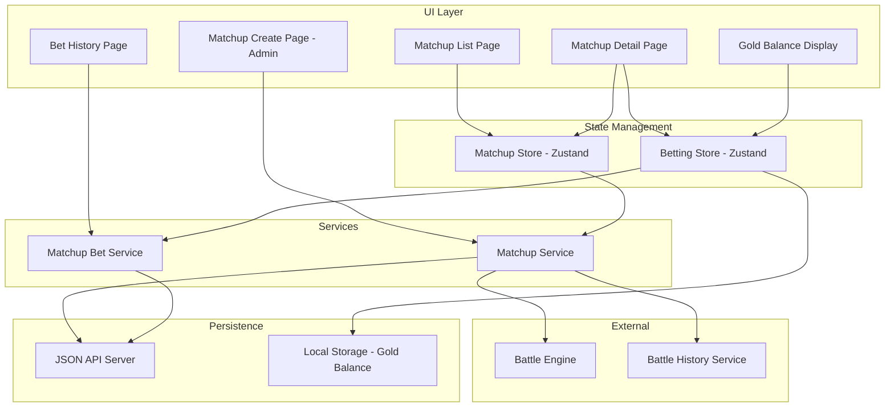

# Design Document: Matchup Betting System

## Overview

Hệ thống Matchup Betting tách biệt quá trình tạo cặp đấu và đặt cược:

- Admin tạo matchup giữa 2 card, lưu vào json-server với status "pending"
- Player xem danh sách matchup pending và đặt cược vào card họ nghĩ sẽ thắng
- Player có thể hủy hoặc update bet trước khi matchup bắt đầu
- Admin start matchup → Battle engine chạy → Kết quả được xác định
- Hệ thống tự động trả thưởng x2 cho người thắng cược
- Lịch sử trận đấu được lưu để xem replay

## Architecture



## Components and Interfaces

### 1. Types (src/features/matchup/types/matchup.ts)

```typescript
/**
 * Matchup status
 */
export type MatchupStatus =
  | "pending"
  | "in_progress"
  | "completed"
  | "cancelled";

/**
 * Matchup record stored in json-server
 */
export interface Matchup {
  id: string;
  card1Id: string;
  card1Name: string;
  card2Id: string;
  card2Name: string;
  status: MatchupStatus;
  winnerId: string | null;
  winnerName: string | null;
  battleHistoryId: string | null;
  createdAt: number;
  startedAt: number | null;
  completedAt: number | null;
}

/**
 * Bet status
 */
export type BetStatus = "active" | "won" | "lost" | "cancelled" | "refunded";

/**
 * Matchup bet record stored in json-server
 */
export interface MatchupBet {
  id: string;
  matchupId: string;
  selectedCardId: string;
  selectedCardName: string;
  betAmount: number;
  status: BetStatus;
  payoutAmount: number | null;
  createdAt: number;
  updatedAt: number;
  resolvedAt: number | null;
}

/**
 * Create matchup request
 */
export interface CreateMatchupRequest {
  card1Id: string;
  card1Name: string;
  card2Id: string;
  card2Name: string;
}

/**
 * Place bet request
 */
export interface PlaceBetRequest {
  matchupId: string;
  selectedCardId: string;
  selectedCardName: string;
  betAmount: number;
}

/**
 * Update bet request
 */
export interface UpdateBetRequest {
  betId: string;
  newAmount: number;
}
```

### 2. Matchup Service (src/features/matchup/services/matchupService.ts)

```typescript
export const matchupService = {
  // Create a new matchup
  createMatchup: (request: CreateMatchupRequest) => Promise<Matchup>;

  // Get all matchups with optional status filter
  getMatchups: (status?: MatchupStatus) => Promise<Matchup[]>;

  // Get single matchup by ID
  getMatchupById: (id: string) => Promise<Matchup | null>;

  // Start a matchup (admin only)
  startMatchup: (matchupId: string) => Promise<Matchup>;

  // Complete a matchup with winner
  completeMatchup: (matchupId: string, winnerId: string, winnerName: string, battleHistoryId: string) => Promise<Matchup>;

  // Cancel a matchup
  cancelMatchup: (matchupId: string) => Promise<Matchup>;
};
```

### 3. Matchup Bet Service (src/features/matchup/services/matchupBetService.ts)

```typescript
export const matchupBetService = {
  // Place a new bet
  placeBet: (request: PlaceBetRequest) => Promise<MatchupBet>;

  // Get bet by ID
  getBetById: (id: string) => Promise<MatchupBet | null>;

  // Get all bets for a matchup
  getBetsByMatchup: (matchupId: string) => Promise<MatchupBet[]>;

  // Get player's bet history
  getBetHistory: () => Promise<MatchupBet[]>;

  // Get player's active bet on a matchup
  getActiveBetForMatchup: (matchupId: string) => Promise<MatchupBet | null>;

  // Update bet amount
  updateBet: (request: UpdateBetRequest) => Promise<MatchupBet>;

  // Cancel a bet
  cancelBet: (betId: string) => Promise<MatchupBet>;

  // Resolve bets for a completed matchup
  resolveBets: (matchupId: string, winnerId: string) => Promise<void>;

  // Refund all bets for a cancelled matchup
  refundBets: (matchupId: string) => Promise<void>;
};
```

### 4. Matchup Store (src/features/matchup/store/matchupStore.ts)

```typescript
interface MatchupStoreState {
  matchups: Matchup[];
  currentMatchup: Matchup | null;
  isLoading: boolean;
  error: string | null;

  // Actions
  fetchMatchups: (status?: MatchupStatus) => Promise<void>;
  fetchMatchupById: (id: string) => Promise<void>;
  createMatchup: (request: CreateMatchupRequest) => Promise<Matchup>;
  startMatchup: (matchupId: string) => Promise<void>;
  cancelMatchup: (matchupId: string) => Promise<void>;
}
```

### 5. Betting Store Updates (src/features/betting/store/bettingStore.ts)

```typescript
// Add to existing betting store
interface BettingStoreState {
  // ... existing state

  // Matchup betting actions
  placeMatchupBet: (request: PlaceBetRequest) => Promise<boolean>;
  updateMatchupBet: (betId: string, newAmount: number) => Promise<boolean>;
  cancelMatchupBet: (betId: string) => Promise<boolean>;
  resolveMatchupBets: (matchupId: string, winnerId: string) => Promise<void>;
}
```

### 6. UI Components

- **MatchupListPage**: Danh sách các matchup pending để bet
- **MatchupDetailPage**: Chi tiết matchup, đặt/sửa/hủy bet
- **MatchupCreatePage**: Admin tạo matchup mới
- **MatchupCard**: Hiển thị thông tin matchup (2 card đối đầu)
- **BetForm**: Form đặt cược với validation
- **MatchupBetHistory**: Lịch sử bet của player trên matchups

## Data Models

### Matchup (JSON API)

```json
{
  "id": "uuid",
  "card1Id": "card-uuid-1",
  "card1Name": "Fire Dragon",
  "card2Id": "card-uuid-2",
  "card2Name": "Ice Phoenix",
  "status": "pending",
  "winnerId": null,
  "winnerName": null,
  "battleHistoryId": null,
  "createdAt": 1702300800000,
  "startedAt": null,
  "completedAt": null
}
```

### MatchupBet (JSON API)

```json
{
  "id": "uuid",
  "matchupId": "matchup-uuid",
  "selectedCardId": "card-uuid-1",
  "selectedCardName": "Fire Dragon",
  "betAmount": 500,
  "status": "active",
  "payoutAmount": null,
  "createdAt": 1702300900000,
  "updatedAt": 1702300900000,
  "resolvedAt": null
}
```

### Local Storage Keys

- `betting_gold_balance`: number - Current gold balance (reuse from existing betting system)

## Correctness Properties

_A property is a characteristic or behavior that should hold true across all valid executions of a system-essentially, a formal statement about what the system should do. Properties serve as the bridge between human-readable specifications and machine-verifiable correctness guarantees._

### Property 1: Matchup Serialization Round-Trip

_For any_ valid Matchup object, serializing to JSON and then deserializing SHALL produce an equivalent object.
**Validates: Requirements 1.4, 1.5**

### Property 2: Same Card Matchup Rejection

_For any_ card, attempting to create a matchup with the same card for both card1 and card2 positions SHALL be rejected.
**Validates: Requirements 1.3**

### Property 3: Matchup Record Completeness

_For any_ created matchup, it SHALL contain all required fields: id, card1Id, card1Name, card2Id, card2Name, status, createdAt.
**Validates: Requirements 1.2**

### Property 4: Pending Matchup Filtering and Sorting

_For any_ list of matchups returned from getMatchups with status "pending", all matchups SHALL have status "pending" and be sorted by createdAt descending.
**Validates: Requirements 2.1**

### Property 5: Invalid Bet Rejection

_For any_ bet amount that is less than or equal to zero OR exceeds the current gold balance, the bet SHALL be rejected and the gold balance SHALL remain unchanged.
**Validates: Requirements 3.2, 3.3**

### Property 6: Bet Deduction Consistency

_For any_ valid bet placement with amount A and initial balance B, the resulting balance SHALL equal B - A.
**Validates: Requirements 3.4**

### Property 7: Non-Pending Matchup Bet Prevention

_For any_ matchup with status other than "pending", placing a new bet, updating an existing bet, or cancelling a bet SHALL be rejected.
**Validates: Requirements 3.6, 4.6**

### Property 8: Bet Cancellation Refund

_For any_ cancelled bet with amount A and current balance B, the resulting balance SHALL equal B + A.
**Validates: Requirements 4.1**

### Property 9: Bet Update Balance Adjustment

_For any_ bet update from amount A1 to A2 with current balance B:

- If A2 > A1, resulting balance SHALL equal B - (A2 - A1)
- If A2 < A1, resulting balance SHALL equal B + (A1 - A2)
  **Validates: Requirements 4.4, 4.5**

### Property 10: Payout Calculation

_For any_ resolved bet with amount A:

- If selected card matches winner, payout SHALL equal 2 \* A and status SHALL be "won"
- If selected card does not match winner, payout SHALL equal 0 and status SHALL be "lost"
  **Validates: Requirements 6.1, 6.2, 6.4**

### Property 11: Matchup Cancellation Refund

_For any_ cancelled matchup, all active bets on that matchup SHALL have status "refunded" and their amounts SHALL be credited back to players' balances.
**Validates: Requirements 6.5**

### Property 12: Bet History Sorting

_For any_ list of bets returned from getBetHistory, the bets SHALL be sorted by createdAt descending.
**Validates: Requirements 7.1**

### Property 13: Balance Persistence Consistency

_For any_ gold balance change (bet placed, bet cancelled, bet updated, payout received), the new balance SHALL be persisted to local storage immediately and match the in-memory state.
**Validates: Requirements 9.2, 9.3**

## Error Handling

### Network Errors

- Khi json-server không khả dụng, hiển thị error message và retry option
- Optimistic updates với rollback nếu server request fail

### Validation Errors

- Bet amount validation: reject nếu <= 0 hoặc > balance
- Same card validation: reject nếu card1Id === card2Id
- Matchup status validation: reject bet operations nếu status !== "pending"

### Edge Cases

- Gold balance = 0: Disable bet placement, show "Insufficient funds"
- No pending matchups: Show empty state message
- Matchup started while editing bet: Show error, refresh matchup status

## Testing Strategy

### Property-Based Testing Library

Sử dụng **fast-check** cho property-based testing trong TypeScript/JavaScript.

### Unit Tests

- Test các service functions riêng lẻ
- Test store actions và state transitions
- Test validation logic

### Property-Based Tests

Mỗi correctness property sẽ được implement bằng một property-based test:

1. **Property 1**: Generate random Matchup objects, verify JSON round-trip
2. **Property 2**: Generate random cardIds, verify same-card matchup rejection
3. **Property 3**: Generate random matchup data, verify all fields present
4. **Property 4**: Generate random matchups with mixed statuses, verify filtering and sorting
5. **Property 5**: Generate random invalid amounts, verify rejection
6. **Property 6**: Generate random valid bets, verify balance deduction
7. **Property 7**: Generate bets on non-pending matchups, verify rejection
8. **Property 8**: Generate random bet cancellations, verify refund
9. **Property 9**: Generate random bet updates, verify balance adjustment
10. **Property 10**: Generate random bet outcomes, verify payout calculation
11. **Property 11**: Generate random matchup cancellations, verify all bets refunded
12. **Property 12**: Generate random bet lists, verify sorting
13. **Property 13**: Generate random balance changes, verify persistence

### Test Configuration

- Minimum 100 iterations per property test
- Each test tagged with: `**Feature: matchup-betting, Property {number}: {property_text}**`
