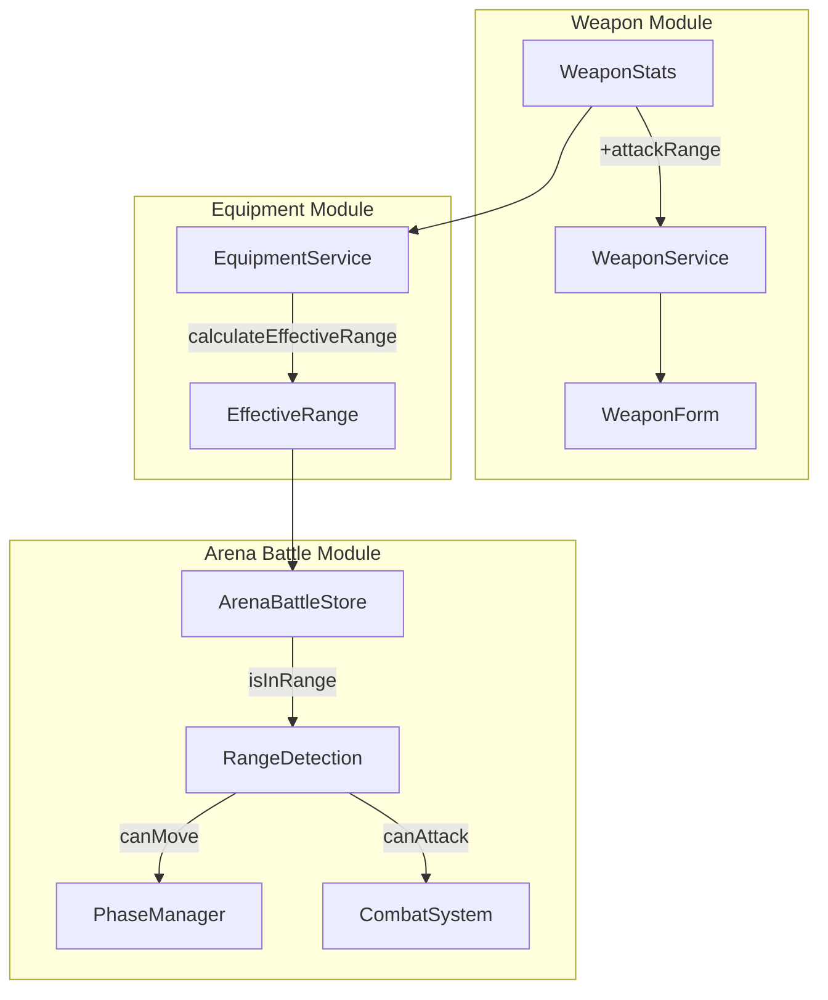

# Design Document: Weapon Attack Range

## Overview

Tính năng Weapon Attack Range mở rộng hệ thống vũ khí hiện tại bằng cách thêm thuộc tính `attackRange` cho vũ khí. Thuộc tính này cho phép card tấn công đối thủ từ xa mà không cần di chuyển đến ô liền kề. Khi đối thủ nằm trong tầm đánh, card bị buộc phải tấn công và không được di chuyển.

Các thay đổi chính:

1. Thêm `attackRange` vào `WeaponStats` interface
2. Tính `effectiveRange` = 1 (base) + weapon.attackRange
3. Cập nhật logic xác định phase và movement trong arena battle
4. Cập nhật combat system để hỗ trợ tấn công tầm xa

## Architecture



## Components and Interfaces

### 1. WeaponStats Extension

```typescript
// src/features/weapons/types/weapon.ts
export interface WeaponStats {
  atk: number;
  critChance: number;
  critDamage: number;
  armorPen: number;
  lifesteal: number;
  attackRange: number; // NEW: 0-6, default 0
}

export const DEFAULT_WEAPON_STATS: WeaponStats = {
  atk: 0,
  critChance: 0,
  critDamage: 0,
  armorPen: 0,
  lifesteal: 0,
  attackRange: 0, // NEW
};

export const WEAPON_STAT_RANGES = {
  // ... existing
  attackRange: { min: 0, max: 6 }, // NEW
} as const;
```

### 2. Range Calculation Functions

```typescript
// src/features/weapons/services/equipmentService.ts

export const DEFAULT_ATTACK_RANGE = 1;

export function calculateEffectiveRange(
  weapon: Weapon | WeaponStats | null,
): number {
  const weaponRange = weapon?.attackRange ?? 0;
  return DEFAULT_ATTACK_RANGE + weaponRange;
}
```

### 3. Arena Range Detection

```typescript
// src/features/battle/store/arenaBattleStore.ts

export function isInAttackRange(
  attackerPos: CellIndex,
  targetPos: CellIndex,
  effectiveRange: number,
): boolean {
  const distance = Math.abs(attackerPos - targetPos);
  return distance <= effectiveRange;
}

export function canCardMove(
  cardPos: CellIndex,
  enemyPos: CellIndex,
  effectiveRange: number,
): boolean {
  return !isInAttackRange(cardPos, enemyPos, effectiveRange);
}
```

### 4. Updated Phase Determination

```typescript
export function determinePhaseWithRange(
  leftPos: CellIndex,
  rightPos: CellIndex,
  leftEffectiveRange: number,
  rightEffectiveRange: number,
): ArenaPhase {
  const distance = Math.abs(leftPos - rightPos);

  // If either card is in range of the other, enter combat
  if (distance <= leftEffectiveRange || distance <= rightEffectiveRange) {
    return PHASE_COMBAT;
  }

  return PHASE_MOVING;
}
```

## Data Models

### WeaponStats (Updated)

| Field       | Type   | Range  | Default | Description         |
| ----------- | ------ | ------ | ------- | ------------------- |
| atk         | number | 0-9999 | 0       | Attack bonus        |
| critChance  | number | 0-100  | 0       | Crit chance %       |
| critDamage  | number | 0-500  | 0       | Crit damage %       |
| armorPen    | number | 0-100  | 0       | Armor penetration % |
| lifesteal   | number | 0-100  | 0       | Lifesteal %         |
| attackRange | number | 0-6    | 0       | Attack range bonus  |

### EffectiveCardStats (Updated)

| Field                   | Type   | Description                   |
| ----------------------- | ------ | ----------------------------- |
| ... existing fields ... |        |                               |
| effectiveRange          | number | Base (1) + weapon attackRange |

### BattleCard (Updated)

| Field                   | Type   | Description                       |
| ----------------------- | ------ | --------------------------------- |
| ... existing fields ... |        |                                   |
| effectiveRange          | number | Calculated effective attack range |

## Correctness Properties

_A property is a characteristic or behavior that should hold true across all valid executions of a system-essentially, a formal statement about what the system should do. Properties serve as the bridge between human-readable specifications and machine-verifiable correctness guarantees._

### Property 1: Weapon attack range default value

_For any_ weapon created without specifying attackRange, the attackRange field SHALL have a value of 0.
**Validates: Requirements 1.1**

### Property 2: Weapon attack range validation bounds

_For any_ attackRange value, the Weapon_System SHALL accept values in range [0, 6] and reject values outside this range.
**Validates: Requirements 1.2**

### Property 3: Weapon serialization round-trip

_For any_ valid weapon with attackRange, serializing then deserializing SHALL produce an equivalent weapon object.
**Validates: Requirements 1.4**

### Property 4: Default effective range without weapon

_For any_ card without an equipped weapon, the effective attack range SHALL be exactly 1.
**Validates: Requirements 2.1**

### Property 5: Effective range calculation with weapon

_For any_ card with an equipped weapon, the effective attack range SHALL equal 1 + weapon.attackRange.
**Validates: Requirements 2.2**

### Property 6: In-range determination using absolute distance

_For any_ two card positions pos1 and pos2, and effective range R, the target is in-range if and only if |pos1 - pos2| <= R.
**Validates: Requirements 3.1, 3.3**

### Property 7: Movement blocked when enemy in range

_For any_ card position and enemy position where distance <= card's effective range, the card SHALL NOT be allowed to move.
**Validates: Requirements 4.1**

### Property 8: Movement allowed when enemy out of range

_For any_ card position and enemy position where distance > card's effective range, the card SHALL be allowed to move.
**Validates: Requirements 4.2**

### Property 9: Attack execution within effective range

_For any_ attacker and target where distance <= attacker's effective range, the Combat_System SHALL allow the attack to execute.
**Validates: Requirements 3.2, 5.1**

### Property 10: Mutual combat when both in range

_For any_ two cards where each is within the other's effective range, both cards SHALL be able to attack based on turn order.
**Validates: Requirements 5.3**

## Error Handling

| Scenario                                  | Handling                                 |
| ----------------------------------------- | ---------------------------------------- |
| Invalid attackRange value (< 0 or > 6)    | Validation error, reject form submission |
| Missing attackRange in legacy weapon data | Default to 0 during deserialization      |
| Weapon without attackRange field          | Apply default value of 0                 |

## Testing Strategy

### Property-Based Testing Library

- **fast-check** (đã được sử dụng trong project)

### Property-Based Tests

Mỗi correctness property sẽ được implement bằng một property-based test riêng biệt:

1. **Property 1 Test**: Generate random weapon creation inputs without attackRange, verify attackRange = 0
2. **Property 2 Test**: Generate random integers, verify validation accepts [0,6] and rejects others
3. **Property 3 Test**: Generate random weapons with attackRange, verify serialize/deserialize round-trip
4. **Property 4 Test**: Generate random cards without weapons, verify effectiveRange = 1
5. **Property 5 Test**: Generate random cards and weapons, verify effectiveRange = 1 + weapon.attackRange
6. **Property 6 Test**: Generate random positions and ranges, verify in-range calculation
7. **Property 7 Test**: Generate scenarios with enemy in range, verify movement blocked
8. **Property 8 Test**: Generate scenarios with enemy out of range, verify movement allowed
9. **Property 9 Test**: Generate attack scenarios within range, verify attack executes
10. **Property 10 Test**: Generate mutual range scenarios, verify both can attack

### Unit Tests

- WeaponForm renders attackRange input field
- WeaponCard displays attackRange stat
- CardDetailPage shows effective range
- Arena UI indicates when movement is blocked due to range

### Test Configuration

- Minimum 100 iterations per property test
- Each test tagged with: `**Feature: weapon-attack-range, Property {number}: {property_text}**`
