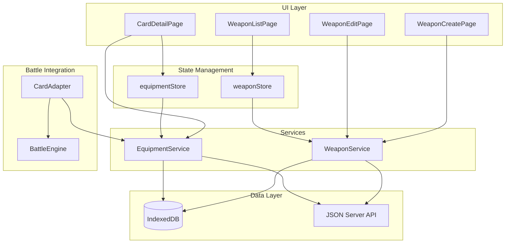

# Design Document: Weapon Equipment System

## Overview

Hệ thống Weapon Equipment cho phép người dùng tạo, quản lý và trang bị vũ khí cho các card. Vũ khí cung cấp các chỉ số tấn công bổ sung (ATK, Crit Chance, Crit Damage, Armor Penetration, Lifesteal) được cộng vào chỉ số cơ bản của card khi tham gia battle.

Hệ thống được thiết kế theo kiến trúc feature-based hiện có của project, với các thành phần: types, services, store, hooks, components, và pages.

## Architecture



## Components and Interfaces

### Weapon Types

```typescript
// Offensive stats that weapons can provide
interface WeaponStats {
  atk: number; // Attack bonus (0-9999)
  critChance: number; // Crit chance bonus (0-100)
  critDamage: number; // Crit damage bonus (0-500)
  armorPen: number; // Armor penetration bonus (0-100)
  lifesteal: number; // Lifesteal bonus (0-100)
}

// Weapon entity
interface Weapon extends WeaponStats {
  id: string;
  name: string;
  imagePath: string | null;
  imageUrl: string | null;
  createdAt: number;
  updatedAt: number;
}

// Form input for creating/editing weapons
interface WeaponFormInput {
  name: string;
  image: File | null;
  atk?: number;
  critChance?: number;
  critDamage?: number;
  armorPen?: number;
  lifesteal?: number;
}

// Default weapon stats
const DEFAULT_WEAPON_STATS: WeaponStats = {
  atk: 0,
  critChance: 0,
  critDamage: 0,
  armorPen: 0,
  lifesteal: 0,
};
```

### Equipment Types

```typescript
// Card-Weapon equipment relationship
interface CardEquipment {
  cardId: string;
  weaponId: string | null;
  equippedAt: number | null;
}

// Effective stats after applying weapon bonuses
interface EffectiveCardStats {
  hp: number;
  atk: number;
  def: number;
  spd: number;
  critChance: number;
  critDamage: number;
  armorPen: number;
  lifesteal: number;
}
```

### WeaponService Interface

```typescript
interface WeaponService {
  getAll(): Promise<Weapon[]>;
  getById(id: string): Promise<Weapon | null>;
  create(input: WeaponFormInput): Promise<Weapon>;
  update(id: string, input: WeaponFormInput): Promise<Weapon | null>;
  delete(id: string): Promise<boolean>;
  getPaginated(params: WeaponListParams): Promise<PaginatedWeapons>;
}
```

### EquipmentService Interface

```typescript
interface EquipmentService {
  getEquipment(cardId: string): Promise<CardEquipment | null>;
  equipWeapon(cardId: string, weaponId: string): Promise<CardEquipment>;
  unequipWeapon(cardId: string): Promise<void>;
  getCardWithWeapon(
    cardId: string,
  ): Promise<{ card: Card; weapon: Weapon | null }>;
  calculateEffectiveStats(
    card: Card,
    weapon: Weapon | null,
  ): EffectiveCardStats;
  findCardByWeaponId(weaponId: string): Promise<string | null>;
}
```

### CardAdapter Enhancement

```typescript
// Enhanced CardAdapter to include weapon bonuses
function cardToCombatantWithWeapon(
  card: Card,
  weapon: Weapon | null,
): Combatant {
  const effectiveStats = calculateEffectiveStats(card, weapon);
  return {
    id: card.id,
    name: card.name,
    imageUrl: card.imageUrl,
    baseStats: {
      atk: effectiveStats.atk,
      def: effectiveStats.def,
      spd: effectiveStats.spd,
      critChance: effectiveStats.critChance,
      critDamage: effectiveStats.critDamage,
      armorPen: effectiveStats.armorPen,
      lifesteal: effectiveStats.lifesteal,
    },
    currentHp: effectiveStats.hp,
    maxHp: effectiveStats.hp,
    buffs: [],
    isDefeated: false,
  };
}
```

## Data Models

### IndexedDB Schema

```typescript
// Add to existing DB schema
interface WeaponDBSchema {
  weapons: {
    key: string;
    value: StoredWeapon;
    indexes: { "by-name": string };
  };
  cardEquipment: {
    key: string; // cardId
    value: CardEquipment;
    indexes: { "by-weapon": string };
  };
}

type StoredWeapon = Omit<Weapon, "imageUrl">;
```

### JSON Server Schema

```json
{
  "weapons": [
    {
      "id": "uuid",
      "name": "Flame Sword",
      "atk": 50,
      "critChance": 10,
      "critDamage": 25,
      "armorPen": 5,
      "lifesteal": 0,
      "imagePath": "weapon-uuid.png",
      "createdAt": 1702300800000,
      "updatedAt": 1702300800000
    }
  ],
  "cardEquipment": [
    {
      "cardId": "card-uuid",
      "weaponId": "weapon-uuid",
      "equippedAt": 1702300800000
    }
  ]
}
```

## Correctness Properties

_A property is a characteristic or behavior that should hold true across all valid executions of a system-essentially, a formal statement about what the system should do. Properties serve as the bridge between human-readable specifications and machine-verifiable correctness guarantees._

### Property 1: Weapon creation with valid data persists correctly

_For any_ valid weapon form input with non-empty name, creating a weapon should result in a weapon being stored with matching name and stats.
**Validates: Requirements 1.1**

### Property 2: Empty/whitespace weapon names are rejected

_For any_ string composed entirely of whitespace characters, attempting to create a weapon with that name should be rejected with a validation error.
**Validates: Requirements 1.2**

### Property 3: Default stats applied when not specified

_For any_ weapon created without specifying stats, all offensive stats (atk, critChance, critDamage, armorPen, lifesteal) should equal 0.
**Validates: Requirements 1.3**

### Property 4: Unique IDs for all weapons

_For any_ set of created weapons, all weapon IDs should be distinct from each other.
**Validates: Requirements 1.4**

### Property 5: Weapon update persists changes with new timestamp

_For any_ existing weapon and valid update input, updating the weapon should persist the new values and set updatedAt > previous updatedAt.
**Validates: Requirements 2.3**

### Property 6: Deleting equipped weapon unequips from card

_For any_ weapon that is equipped to a card, deleting the weapon should result in the card having no equipped weapon (weaponId = null).
**Validates: Requirements 2.4**

### Property 7: Equipment association persists correctly

_For any_ card and weapon, equipping the weapon to the card should result in a persisted relationship where getEquipment(cardId).weaponId equals the weapon's ID.
**Validates: Requirements 3.2**

### Property 8: Effective stats calculation is additive

_For any_ card with base stats and equipped weapon with bonus stats, the effective stats should equal base stats + weapon stats for all offensive stats (atk, critChance, critDamage, armorPen, lifesteal).
**Validates: Requirements 3.3, 4.1, 4.2, 4.3, 4.4, 4.5, 4.6**

### Property 9: Unequip reverts to base stats

_For any_ card with an equipped weapon, unequipping should result in effective stats equaling base stats.
**Validates: Requirements 3.4**

### Property 10: Weapon exclusivity - one card at a time

_For any_ weapon equipped to card A, equipping it to card B should result in card A having no equipped weapon and card B having the weapon.
**Validates: Requirements 3.5**

### Property 11: Weapon serialization round-trip

_For any_ valid weapon object, serializing to JSON then deserializing should produce an equivalent weapon object.
**Validates: Requirements 5.1, 5.2, 5.3**

### Property 12: Equipment state serialization round-trip

_For any_ valid card equipment state, serializing then deserializing should produce an equivalent equipment relationship.
**Validates: Requirements 6.1, 6.2, 6.3**

## Error Handling

| Error Scenario               | Handling Strategy                         |
| ---------------------------- | ----------------------------------------- |
| Empty weapon name            | Return validation error, prevent creation |
| Weapon not found             | Return null or throw NotFoundError        |
| Card not found for equipment | Throw NotFoundError                       |
| Database operation failure   | Throw with descriptive error message      |
| Image upload failure         | Log error, continue without image         |
| Invalid stat values          | Clamp to valid range (0-max)              |

## Testing Strategy

### Property-Based Testing Library

Sử dụng **fast-check** cho property-based testing trong TypeScript/JavaScript.

### Unit Tests

- WeaponService CRUD operations
- EquipmentService equip/unequip operations
- Effective stats calculation
- Validation functions

### Property-Based Tests

Mỗi correctness property sẽ được implement bằng một property-based test riêng biệt:

1. **Property 1**: Generate random valid weapon inputs, verify persistence
2. **Property 2**: Generate whitespace-only strings, verify rejection
3. **Property 3**: Create weapons without stats, verify defaults
4. **Property 4**: Create multiple weapons, verify unique IDs
5. **Property 5**: Update weapons, verify timestamp increases
6. **Property 6**: Equip then delete weapon, verify card unequipped
7. **Property 7**: Equip weapon, verify relationship persisted
8. **Property 8**: Generate card + weapon, verify effective stats = base + bonus
9. **Property 9**: Equip then unequip, verify stats revert
10. **Property 10**: Equip to A then B, verify A unequipped
11. **Property 11**: Generate weapons, verify JSON round-trip
12. **Property 12**: Generate equipment states, verify round-trip

### Test Configuration

- Minimum 100 iterations per property test
- Each test tagged with: `**Feature: weapon-equipment, Property {number}: {property_text}**`
